# BartonMatter Thunder Plugin - API Flow Diagram

## Complete System Architecture

```mermaid
graph TB
    %% External Clients
    Client[Thunder Client<br/>JSON-RPC/REST]
    WebUI[Web UI/App]
    
    %% Thunder Framework Layer
    subgraph Thunder["Thunder Framework Layer"]
        JsonRPC[JSON-RPC Interface]
        ThunderCore[Thunder Core]
        PluginHost[Plugin Host]
    end
    
    %% Your Plugin Layer
    subgraph Plugin["BartonMatter Plugin (C++)"]
        Interface[IBartonMatter Interface]
        
        subgraph Methods["Plugin Methods"]
            SetWifi[SetWifiCredentials<br/>std::string ssid, password]
            InitComm[InitializeCommissioner<br/>]
            CommDev[CommissionDevice<br/>std::string passcode]
        end
        
        subgraph Internal["Internal Methods"]
            InitClient[InitializeClient<br/>gchar* confDir]
            SetDefaults[SetDefaultParameters<br/>BCoreInitializeParamsContainer*]
            Commission[Commission<br/>BCoreClient*, setupPayload, timeout]
            GetConfig[GetConfigDirectory<br/>]
        end
        
        subgraph Events["Event Handlers"]
            DeviceHandler[DeviceAddedHandler<br/>static callback]
        end
    end
    
    %% Glue Layer
    subgraph Glue["C to C++ Glue Layer"]
        subgraph GlobalVars["Global Variables"]
            SSID[network_ssid<br/>gchar*]
            PSK[network_psk<br/>gchar*]
            Mutex[networkCredsMtx<br/>std::mutex]
        end
        
        subgraph CGlib["C GLib Functions"]
            ProviderNew[b_reference_network_credentials_provider_new]
            SetCreds[b_reference_network_credentials_provider_set_wifi_network_credentials]
            GetCreds[b_reference_network_credentials_provider_get_wifi_network_credentials]
        end
        
        subgraph GObject["GObject Implementation"]
            ProviderStruct[BReferenceNetworkCredentialsProvider<br/>GObject]
            Interface_Init[provider_interface_init]
            Class_Init[provider_class_init]
        end
    end
    
    %% Barton Core Layer
    subgraph BartonCore["Barton Core Library (C/GLib)"]
        subgraph CoreAPI["Core API"]
            Client_BC[BCoreClient]
            InitParams[BCoreInitializeParamsContainer]
            PropertyProvider[BCorePropertyProvider]
        end
        
        subgraph Credentials["Credentials Interface"]
            CredProvider[BCoreNetworkCredentialsProvider]
            WifiCreds[BCoreWifiNetworkCredentials]
        end
        
        subgraph Events_BC["Events"]
            DeviceAdded[BCoreDeviceAddedEvent]
            DeviceSignal[B_CORE_CLIENT_SIGNAL_NAME_DEVICE_ADDED]
        end
        
        subgraph Matter["Matter Protocol"]
            MatterStack[Matter/Thread Stack]
            Commission_BC[Commission Process]
        end
    end
    
    %% External Systems
    subgraph External["External Systems"]
        MatterDevice[Matter Device<br/>IoT Device]
        Network[WiFi Network]
        FileSystem[File System<br/>/opt/.brtn-ds]
    end
    
    %% API Flow Connections
    Client --> JsonRPC
    WebUI --> JsonRPC
    JsonRPC --> ThunderCore
    ThunderCore --> PluginHost
    PluginHost --> Interface
    
    %% Plugin Internal Flow
    Interface --> SetWifi
    Interface --> InitComm
    Interface --> CommDev
    
    SetWifi --> SetCreds
    SetCreds --> SSID
    SetCreds --> PSK
    SetCreds -.-> Mutex
    
    InitComm --> GetConfig
    InitComm --> InitClient
    GetConfig --> FileSystem
    
    InitClient --> InitParams
    InitClient --> ProviderNew
    InitClient --> Client_BC
    InitClient --> SetDefaults
    InitClient -.->|g_signal_connect| DeviceSignal
    
    CommDev --> Commission
    Commission --> Client_BC
    
    %% Glue Layer Connections
    ProviderNew --> ProviderStruct
    ProviderStruct --> Interface_Init
    ProviderStruct --> Class_Init
    
    GetCreds -.-> SSID
    GetCreds -.-> PSK
    GetCreds -.-> Mutex
    GetCreds --> WifiCreds
    
    %% Barton Core Connections
    Client_BC --> CredProvider
    CredProvider --> GetCreds
    WifiCreds --> Network
    
    Client_BC --> Commission_BC
    Commission_BC --> MatterStack
    MatterStack <--> MatterDevice
    
    DeviceSignal --> DeviceAdded
    DeviceAdded --> DeviceHandler
    
    %% File System
    InitParams --> FileSystem
    
    %% Styling
    classDef thunder fill:#e1f5fe
    classDef plugin fill:#f3e5f5
    classDef glue fill:#fff3e0
    classDef barton fill:#e8f5e8
    classDef external fill:#fce4ec
    
    class JsonRPC,ThunderCore,PluginHost thunder
    class Interface,SetWifi,InitComm,CommDev,InitClient,SetDefaults,Commission,GetConfig,DeviceHandler plugin
    class SSID,PSK,Mutex,ProviderNew,SetCreds,GetCreds,ProviderStruct,Interface_Init,Class_Init glue
    class Client_BC,InitParams,PropertyProvider,CredProvider,WifiCreds,DeviceAdded,DeviceSignal,MatterStack,Commission_BC barton
    class MatterDevice,Network,FileSystem external
```



## API Flow Summary

### 1. Client APIs (JSON-RPC)
```json
// Set WiFi Credentials
POST /jsonrpc
{
  "jsonrpc": "2.0",
  "method": "BartonMatter.1.SetWifiCredentials",
  "params": {"ssid": "MyWiFi", "password": "MyPass"}
}

// Initialize Commissioner
POST /jsonrpc
{
  "jsonrpc": "2.0", 
  "method": "BartonMatter.1.InitializeCommissioner"
}

// Commission Device
POST /jsonrpc
{
  "jsonrpc": "2.0",
  "method": "BartonMatter.1.CommissionDevice", 
  "params": {"passcode": "20202021"}
}
```

### 2. Data Flow
```
Thunder Client → JSON-RPC → Thunder Core → Plugin → C++ Methods → C Glue → Barton Core → Matter Protocol
```

### 3. Event Flow
```
Matter Device → Barton Core Events → C Callbacks → C++ Handlers → Thunder Notifications
```