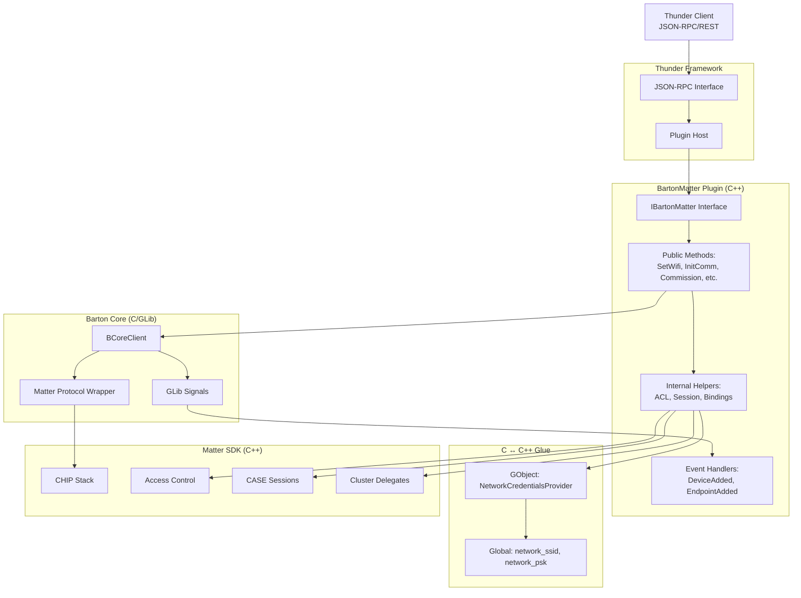

# BartonMatter Thunder Plugin - Complete Technical Documentation

## Table of Contents
1. [Overview](#overview)
2. [Quick Start](#quick-start)
3. [JSON-RPC API Reference](#json-rpc-api-reference)
4. [Architecture & Design](#architecture--design)
5. [Implementation Details](#implementation-details)
6. [Testing & Verification](#testing--verification)

---

## Overview

**Version**: `org.rdk.barton.1`

The BartonMatter plugin is a Thunder framework plugin that bridges application-layer JSON-RPC APIs with the Matter protocol stack. It enables Matter device commissioning, control, and management on RDK platforms, specifically designed for TV casting and control use cases.

### Key Features
- Matter device commissioning via passcode or QR code
- WiFi credential provisioning for commissioned devices
- Device lifecycle management (add, remove, list)
- Commissioning window management for Alexa/controller discovery
- Access Control List (ACL) and Binding configuration
- Inbound command handling (key press, app launch)

### Architecture Layers
```
UI Application (JSON-RPC Client)
    ↓
Thunder Framework (JSON-RPC Server)
    ↓
BartonMatter Plugin (C++)
    ↓
Barton Core Client (C/GLib wrapper)
    ↓
Matter SDK (Project CHIP)
    ↓
Matter Network (Thread/WiFi)
```

---

## Quick Start

### Plugin Activation
```bash
# Activate the plugin
curl -H "Content-Type: application/json" --request POST --data \
'{"jsonrpc":"2.0","id":"3","method":"Controller.1.activate","params":{"callsign":"org.rdk.barton"}}' \
http://127.0.0.1:9998/jsonrpc

# Deactivate the plugin
curl -H "Content-Type: application/json" --request POST --data \
'{"jsonrpc":"2.0","id":"3","method":"Controller.1.deactivate","params":{"callsign":"org.rdk.barton"}}' \
http://127.0.0.1:9998/jsonrpc
```

### Basic Workflow
```bash
# 1. Set WiFi credentials for provisioning
curl -X POST http://127.0.0.1:9998/jsonrpc -d '{
  "jsonrpc":"2.0","id":1,
  "method":"BartonMatter.1.SetWifiCredentials",
  "params":{"ssid":"MyNetwork","password":"MyPassword"}
}'

# 2. Initialize the Matter commissioner
curl -X POST http://127.0.0.1:9998/jsonrpc -d '{
  "jsonrpc":"2.0","id":2,
  "method":"BartonMatter.1.InitializeCommissioner"
}'

# 3. Commission a device using setup code
curl -X POST http://127.0.0.1:9998/jsonrpc -d '{
  "jsonrpc":"2.0","id":3,
  "method":"BartonMatter.1.CommissionDevice",
  "params":{"passcode":"MT:Y.K9042C00KA0648G00"}
}'

# 4. Open commissioning window for Alexa discovery
curl -X POST http://127.0.0.1:9998/jsonrpc -d '{
  "jsonrpc":"2.0","id":4,
  "method":"BartonMatter.1.OpenCommissioningWindow",
  "params":{"timeoutSeconds":180}
}'
# Returns: {"manualCode":"34970112332","qrCode":"MT:..."}

# 5. List commissioned devices
curl -X POST http://127.0.0.1:9998/jsonrpc -d '{
  "jsonrpc":"2.0","id":5,
  "method":"BartonMatter.1.GetCommissionedDeviceInfo"
}'
```

---

## JSON-RPC API Reference

### 1. SetWifiCredentials
Configures WiFi credentials for network provisioning during commissioning.

**Request**:
```json
{
  "jsonrpc": "2.0",
  "method": "BartonMatter.1.SetWifiCredentials",
  "params": {
    "ssid": "MyWiFi",
    "password": "MyPassword"
  }
}
```

**Response**: `{"success": true}`

---

### 2. InitializeCommissioner
Initializes the Barton Core client and Matter commissioner stack.

**Request**:
```json
{
  "jsonrpc": "2.0",
  "method": "BartonMatter.1.InitializeCommissioner"
}
```

**Response**: `{"success": true}`

**Side Effects**:
- Creates configuration directory `/opt/.brtn-ds`
- Initializes Matter KVS storage
- Sets default passcode (20202021) and discriminator (3840)
- Registers cluster delegates for inbound commands

---

### 3. CommissionDevice
Commissions a Matter device using a setup code (QR or manual pairing code).

**Request**:
```json
{
  "jsonrpc": "2.0",
  "method": "BartonMatter.1.CommissionDevice",
  "params": {
    "passcode": "MT:Y.K9042C00KA0648G00"
  }
}
```

**Response**: `{"success": true}`

**Flow**:
1. Plugin calls `b_core_client_commission_device()`
2. Barton Core spawns Matter commissioning thread
3. PASE handshake, certificate exchange, NOC provisioning
4. Device added to `devicedb` filesystem storage
5. `DeviceAddedHandler` signal fires
6. Plugin creates ACL entries for the device
7. Plugin establishes CASE session and writes bindings

---

### 4. OpenCommissioningWindow
Opens a commissioning window on the local device for Alexa or other controllers to discover and commission it.

**Request**:
```json
{
  "jsonrpc": "2.0",
  "method": "BartonMatter.1.OpenCommissioningWindow",
  "params": {
    "timeoutSeconds": 180
  }
}
```

**Response**:
```json
{
  "manualCode": "34970112332",
  "qrCode": "MT:Y.K9042C00KA0648G00"
}
```

**Use Case**: Display the 11-digit `manualCode` to the user so Alexa can commission the TV using "Add Device" → "Enter Code".

**Technical Details**:
- Calls `b_core_client_open_commissioning_window(bartonClient, "0", timeoutSeconds)`
- The "0" or NULL deviceId indicates opening window on local device
- Matter SDK generates the 11-digit code by encoding passcode + discriminator
- Window stays open for specified timeout (default: 3 minutes)

---

### 5. RemoveDevice
Removes a commissioned device and cleans up all associated state.

**Request**:
```json
{
  "jsonrpc": "2.0",
  "method": "BartonMatter.1.RemoveDevice",
  "params": {
    "deviceUuid": "90034FD9068DFF14"
  }
}
```

**Response**: `{"success": true}`

**Cleanup Operations**:
1. Convert UUID to node ID
2. Delete ACL entries for the node
3. Release CASE sessions for the node
4. Call `b_core_client_remove_device()` to delete devicedb file
5. Clear plugin's commissioned device cache

---

### 6. ListDevices
Returns list of currently connected devices (runtime state from Barton Core).

**Request**:
```json
{
  "jsonrpc": "2.0",
  "method": "BartonMatter.1.ListDevices"
}
```

**Response**:
```json
["90034FD9068DFF14", "A1B2C3D4E5F6G7H8"]
```

---

### 7. GetCommissionedDeviceInfo
Returns commissioned device info from devicedb persistence.

**Request**:
```json
{
  "jsonrpc": "2.0",
  "method": "BartonMatter.1.GetCommissionedDeviceInfo"
}
```

**Response**:
```json
[
  {"nodeId": "90034FD9068DFF14", "model": "CastingClient"},
  {"nodeId": "A1B2C3D4E5F6G7H8", "model": "TV-CASTING"}
]
```

**Caching**: Results are cached after first scan. Cache is invalidated on `RemoveDevice()`.

---

### 8. ReadResource / WriteResource
Generic cluster attribute read/write (uses Barton Core wrapper).

**Read Example**:
```json
{
  "method": "BartonMatter.1.ReadResource",
  "params": {
    "uri": "90034FD9068DFF14",
    "resourceType": "powerState"
  }
}
```

**Write Example**:
```json
{
  "method": "BartonMatter.1.WriteResource",
  "params": {
    "uri": "90034FD9068DFF14",
    "resourceType": "volume",
    "value": "50"
  }
}
```

---

## Architecture & Design

### User Flow (UI → Plugin → Barton Core → Matter)

1. **UI calls plugin** via JSON-RPC: `InitializeCommissioner()`, `CommissionDevice(passcode)`, `RemoveDevice(deviceUuid)`, or `OpenCommissioningWindow(timeout)`
2. **Plugin validates** and delegates to Barton Core client (`b_core_client_*`) for lifecycle operations
3. **Barton Core** handles PASE, NOC exchange, persistence to `devicedb`, and emits GLib signals
4. **Plugin receives signals** (GLib thread) and updates in-memory cache (`commissionedDevicesCache`)
5. **Plugin schedules Matter work** to event loop thread for ACLs, sessions, bindings
6. **Matter thread** performs secure operations via Matter SDK, persists to KVS
7. **Callbacks return** to plugin logic, which sends JSON-RPC responses to UI

### Plain-Language Explanation

When you press "Add Device":
- UI tells plugin: "Add this device using this passcode"
- Plugin asks Barton Core to do the actual handshake
- Barton Core handles network and security, writes device file to disk when finished
- Plugin then sets up permissions (ACLs) so the device can control the TV
- Plugin writes binding entries so the device knows which endpoints to talk to

When you remove a device:
- Plugin removes device file and cleans up permissions (ACLs)
- Releases active secure sessions so device can be safely recommissioned later

### Component Diagram



### Hybrid Architecture Strategy

**Barton Core is used for**:
- Device commissioning (`b_core_client_commission_device`)
- Device removal (`b_core_client_remove_device`)
- Device listing (`b_core_client_get_devices`)
- Generic resource access (`read_resource`, `write_resource`)

**Rationale**: Stable, simplified API for complex lifecycle operations. Abstracts commissioning state machines and devicedb persistence.

**Matter SDK is used directly for**:
- ACL management (`chip::Access::AccessControl`)
- CASE session establishment (`CASESessionManager`)
- Binding table writes (`chip::app::WriteClient`)
- Inbound command handling (cluster delegates)

**Rationale**: Application-specific interactions requiring fine-grained control. Barton Core doesn't expose these advanced features.

---

## Implementation Details

### Thread Safety

Three threads in play:
1. **Thunder thread**: Handles JSON-RPC, calls into plugin
2. **Matter thread**: Runs chip event loop, handles protocol
3. **GLib thread**: Runs Barton core client main loop, emits signals

**Synchronization**:
- `chip::DeviceLayer::PlatformMgr().ScheduleWork()`: Cross-thread dispatch (Thunder → Matter)
- `std::mutex devicesCacheMtx`: Protects `commissionedDevicesCache` map
- `std::mutex networkCredsMtx`: Protects WiFi credentials
- GLib signals use callbacks to marshal to correct thread

**Critical Rule**: Never call Matter SDK APIs from Thunder thread directly. Always use `ScheduleWork()`.

### Callback Delegates Pattern

Matter SDK requires static callbacks (C-style function pointers). We bridge to C++ member functions using trampolines:

```cpp
// Member variables (initialized in constructor)
chip::Callback::Callback<...> mSuccessCallback;
chip::Callback::Callback<...> mFailureCallback;

// Constructor initialization
mSuccessCallback(OnSessionEstablishedStatic, this),
mFailureCallback(OnSessionFailureStatic, this)

// Static trampoline
static void OnSessionEstablishedStatic(void* context, ...) {
    reinterpret_cast<BartonMatterImplementation*>(context)->OnSessionEstablished(...);
}

// Actual handler
void OnSessionEstablished(const chip::SessionHandle& sessionHandle) {
    // Can access member variables here
}
```

### ACL Entry Structure

When creating an ACL entry:
```cpp
AccessControl::Entry entry;
entry.SetAuthMode(AuthMode::kCase);              // Certificate auth
entry.SetPrivilege(Privilege::kAdminister);      // Full access
entry.SetFabricIndex(1);                         // Fabric #1
entry.AddSubject(nullptr, nodeId);               // Grant to this node
entry.AddTarget(nullptr, {.endpoint = 1});       // Access endpoint 1
entry.AddTarget(nullptr, {.endpoint = 2});       // Access endpoint 2
entry.AddTarget(nullptr, {.endpoint = 3});       // Access endpoint 3
GetAccessControl().CreateEntry(nullptr, 1, nullptr, entry);
```

### Binding Cluster Write

After CASE session is established, write bindings to client device:

```cpp
void WriteClientBindings(...) {
    // Build binding list
    std::vector<TargetStruct> bindings = {
        {.node = localNodeId, .endpoint = 1},
        {.node = localNodeId, .endpoint = 2},
        {.node = localNodeId, .endpoint = 3}
    };

    // Create WriteClient
    auto writeClient = new WriteClient(&exchangeMgr, ...);

    // Encode attribute
    AttributePathParams path;
    path.mEndpointId = 1;
    path.mClusterId = Binding::Id;
    path.mAttributeId = Binding::Attributes::Binding::Id;

    writeClient->EncodeAttribute(path, bindingListAttr);
    writeClient->SendWriteRequest(sessionHandle);
}
```

### Commissioning Window Details

The 11-digit manual code is **not** the raw passcode. It's an encoded format combining:
- Passcode (e.g., 20202021)
- Discriminator (e.g., 3840)
- Vendor/product metadata

Matter SDK's `ManualSetupPayloadGenerator` encodes these into the 11-digit decimal string.

**Example**:
```
Passcode: 20202021        (8 digits, uint32)
Discriminator: 3840       (12-bit value)
           ↓
Manual Code: 34970112332  (11 digits, generated by SDK)
```

When `OpenCommissioningWindow()` is called, the SDK automatically converts stored passcode/discriminator into the proper 11-digit format.

### Device Database Schema

Barton Core stores devices in `/opt/.brtn-ds/storage/devicedb/` with JSON structure:

```json
{
  "nodeId": "90034FD9068DFF14",
  "fabric": 1,
  "vendorId": 65521,
  "productId": 32769,
  "model": {
    "value": "CastingClient-Model-1"
  }
}
```

Plugin scans this directory and extracts `model` value for cache.

### Error Codes

- `CHIP_NO_ERROR` (0x00000000): Success
- `CHIP_ERROR_DUPLICATE_KEY_ID` (0x00000019): ACL entry already exists
- `CHIP_ERROR_NOT_FOUND`: Deletion target not found (treat as success)
- `CHIP_ERROR_INVALID_ARGUMENT`: Input validation failed
- `CHIP_ERROR_TIMEOUT`: Network or CASE timeout (implement retry)

### Call Trace: Commission Device

1. `CommissionDevice(passcode)` - Thunder thread
2. Validate input, call `b_core_client_commission_device()`
3. Barton Core spawns Matter commissioning thread
4. PASE handshake, certificate exchange, NOC exchange
5. Write to devicedb: `/opt/.brtn-ds/storage/devicedb/[nodeId]`
6. Emit `DeviceAdded` signal (GLib)
7. `DeviceAddedHandler` (GLib thread) → update cache
8. `AddACLEntryForClient` (schedules to Matter thread)
9. Create ACL entry with 3 targets (endpoints 1, 2, 3)
10. Schedule `EstablishSessionWork` (Matter thread)
11. CASE session manager establishes session
12. Callback: `OnSessionEstablished` (Matter thread)
13. `WriteClientBindings` - encode and send

### Call Trace: Remove Device

1. `RemoveDevice(deviceUuid)` - Thunder thread
2. Convert UUID → nodeId
3. `RemoveACLEntriesForNode(nodeId)` - enumerate and delete
4. Schedule CASE session release for node
5. `b_core_client_remove_device()` - delete devicedb file
6. Lock cache mutex, clear map, set `devicesCacheInitialized = false`

---

## Testing & Verification

### Commissioning Test
```bash
# 1. Initialize
curl -X POST http://127.0.0.1:9998/jsonrpc -d \
'{"jsonrpc":"2.0","id":1,"method":"BartonMatter.1.InitializeCommissioner"}'

# 2. Commission device
curl -X POST http://127.0.0.1:9998/jsonrpc -d \
'{"jsonrpc":"2.0","id":2,"method":"BartonMatter.1.CommissionDevice","params":{"passcode":"MT:Y.K9042C00KA0648G00"}}'

# 3. Verify in logs
# Expected: "Device added! UUID=..., class=..."
# Expected: "Successfully created ACL entry with 3 endpoints"
# Expected: "Session established with Node: 0x..."

# 4. Check devicedb
ls /opt/.brtn-ds/storage/devicedb/
# Should see new file with nodeId as filename

# 5. Verify commissioned devices
curl -X POST http://127.0.0.1:9998/jsonrpc -d \
'{"jsonrpc":"2.0","id":3,"method":"BartonMatter.1.GetCommissionedDeviceInfo"}'
```

### Commissioning Window Test (Alexa)
```bash
# 1. Open window
curl -X POST http://127.0.0.1:9998/jsonrpc -d \
'{"jsonrpc":"2.0","id":1,"method":"BartonMatter.1.OpenCommissioningWindow","params":{"timeoutSeconds":180}}'

# Response: {"manualCode":"34970112332","qrCode":"MT:..."}

# 2. Logs should show
# "Commissioning window opened successfully"
# "Manual Code (11-digit): 34970112332"

# 3. In Alexa app
# - Go to Devices → Add Device
# - Select "Matter" or "Other"
# - Enter manual code: 34970112332
# - Wait for discovery and pairing
```

### Removal Test
```bash
# 1. Get device list
curl -X POST http://127.0.0.1:9998/jsonrpc -d \
'{"jsonrpc":"2.0","id":1,"method":"BartonMatter.1.GetCommissionedDeviceInfo"}'

# 2. Remove device
curl -X POST http://127.0.0.1:9998/jsonrpc -d \
'{"jsonrpc":"2.0","id":2,"method":"BartonMatter.1.RemoveDevice","params":{"deviceUuid":"90034FD9068DFF14"}}'

# 3. Verify removal
ls /opt/.brtn-ds/storage/devicedb/
# File should be gone

# 4. Query again
curl -X POST http://127.0.0.1:9998/jsonrpc -d \
'{"jsonrpc":"2.0","id":3,"method":"BartonMatter.1.GetCommissionedDeviceInfo"}'
# Should not include removed device
```

### ACL Verification (Matter CLI)
```bash
# On Barton device
matter accesscontrol read-entry 0 1  # fabric 1, entry 0
# Should show subjects and targets for commissioned device
```

### Binding Verification
```bash
# On client device
matter binding read endpoint 1
# Should show 3 bindings pointing to Barton's endpoints 1, 2, 3
```

---

## Configuration Files

### Default Paths
- Config directory: `/opt/.brtn-ds/`
- Matter storage: `/opt/.brtn-ds/matter/`
- Device database: `/opt/.brtn-ds/storage/devicedb/`
- Matter KVS: `/opt/.brtn-ds/matter/matterkv/`

### Default Credentials
```cpp
// Set in SetDefaultParameters()
Discriminator: 3840
Passcode: 20202021
Vendor ID: 0xFFF1 (65521)
Product ID: 0x5678 (22136)
Device Type: 35 (Video Player)
```

### Build Configuration
```cpp
// From BartonProjectConfig.h
CHIP_DEVICE_CONFIG_ENABLE_BOTH_COMMISSIONER_AND_COMMISSIONEE 1
CHIP_DEVICE_CONFIG_ENABLE_COMMISSIONER_DISCOVERY 1
CHIP_DEVICE_CONFIG_DEVICE_TYPE 35  // Video Player
```

---

## Troubleshooting

### Device Not Appearing After Commission
**Issue**: `GetCommissionedDeviceInfo()` returns empty or stale list.

**Solution**: Cache may be stale. Plugin invalidates cache on `RemoveDevice()`. Check:
```bash
ls /opt/.brtn-ds/storage/devicedb/
# Verify device file exists

# Force cache refresh by calling RemoveDevice then query again
```

### Recommissioning Fails with "Fabric Already Exists"
**Issue**: Previous commission didn't clean up properly.

**Solution**: Plugin now releases CASE sessions before removal. Ensure you're using latest code with:
- `RemoveACLEntriesForNode()` implementation
- CASE session release scheduling

### ACL CreateEntry Fails with DUPLICATE_KEY_ID
**Issue**: ACL entry for node already exists from previous commission.

**Solution**: Plugin's `RemoveACLEntriesForNode()` should delete these. Verify:
```bash
# Check Matter logs for:
"RemoveACLEntriesForNode: Found ACL entry at index N for node 0x..."
"RemoveACLEntriesForNode: Deleted ACL entry at index N"
```

### OpenCommissioningWindow Returns Invalid Code
**Issue**: Generated code doesn't work with Alexa.

**Check**:
1. Logs show "Manual Code (11-digit): ..." - verify it's 11 digits
2. Passcode and discriminator are set correctly
3. Commissioning window timeout hasn't expired (default 180s)

### Thread Crashes or Race Conditions
**Issue**: Calling Matter APIs from wrong thread.

**Solution**: All Matter SDK calls must use `ScheduleWork()`:
```cpp
chip::DeviceLayer::PlatformMgr().ScheduleWork(
    &BartonMatterImplementation::WorkFunction,
    reinterpret_cast<intptr_t>(this)
);
```

---

## References

- [Matter Specification](https://csa-iot.org/developer-resource/specifications-download-request/)
- [Project CHIP GitHub](https://github.com/project-chip/connectedhomeip)
- [Thunder Framework](https://github.com/rdkcentral/Thunder)
- Internal: `BartonCore/docs/USING_BARTON_GUIDE.md`

---

**Last Updated**: December 18, 2025
**Version**: 1.0
**Maintainer**: Barton Matter Plugin Team

