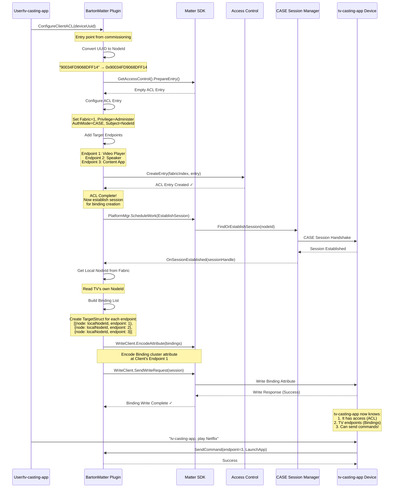

# ACL and Binding Creation Flow

## Overview

This document explains how BartonMatter configures Access Control Lists (ACLs) and Bindings when a client device (like tv-casting-app) is commissioned and needs to control the TV.

---

## Table of Contents

1. [Layman's Explanation](#laymans-explanation)
2. [Technical Overview](#technical-overview)
3. [Detailed Flow Diagram](#detailed-flow-diagram)
4. [Component Breakdown](#component-breakdown)
5. [Code Flow](#code-flow)
6. [Data Structures](#data-structures)
7. [Error Handling](#error-handling)

---

## Layman's Explanation

### The Problem

Imagine your TV is like a secured building with multiple rooms (endpoints):
- **Room 1**: Video Player controls (play, pause, volume)
- **Room 2**: Speaker controls (audio settings)
- **Room 3**: App controls (Netflix, YouTube, etc.)

When tv-casting-app wants to control your TV, we need to:
1. **Give tv-casting-app a key** (ACL - Access Control List) to enter specific rooms
2. **Tell tv-casting-app which rooms exist** (Bindings) and how to reach them

### The Solution

**Step 1: Creating the Access Pass (ACL)**
- When you say "tv-casting-app, pair with my TV", the TV creates a special access pass
- This pass lists exactly which rooms (endpoints) tv-casting-app can access
- It's like giving tv-casting-app a hotel key card that only works on floors 1, 2, and 3

**Step 2: Providing the Directory (Bindings)**
- After giving the access pass, the TV sends tv-casting-app a directory
- The directory says: "Room 1 is for video, Room 2 is for audio, Room 3 is for apps"
- Now tv-casting-app knows where to send commands when you say "Play Netflix"

### Real-World Analogy

```
You (via tv-casting-app): "I want to control the TV"
TV Security System: "Let me check your credentials..."
TV: "OK, you're authorized! Here's your access card (ACL)"
TV: "And here's a map showing all the rooms you can access (Bindings)"
tv-casting-app: "Great! Now when the user says 'play video', I know to go to Room 1"
```

---

## Technical Overview

### Purpose

The ACL and Binding creation flow enables a commissioned Matter client (controller) to:
1. **Gain authorized access** to specific endpoints on the TV (ACL creation)
2. **Discover available endpoints** and their capabilities (Binding creation)
3. **Execute cluster commands** on those endpoints

### Key Concepts

- **ACL (Access Control List)**: Security policy that defines which nodes can access which endpoints
- **Binding**: Relationship that maps a controller to specific server endpoints
- **Endpoint**: A logical unit representing a device feature (e.g., Video Player = Endpoint 1)
- **CASE Session**: Secure authenticated communication channel between devices
- **WriteClient**: Matter SDK mechanism to write attributes remotely

---

## Detailed Flow Diagram



### Flow Phases

```
┌─────────────────────────────────────────────────────────────────┐
│                    Phase 1: ACL Creation                        │
│  Purpose: Grant access permissions to client device             │
│  Duration: ~10-50ms                                             │
└─────────────────────────────────────────────────────────────────┘
                              ↓
┌─────────────────────────────────────────────────────────────────┐
│                  Phase 2: Session Establishment                 │
│  Purpose: Create secure authenticated channel (CASE)            │
│  Duration: ~100-500ms (includes crypto handshake)               │
└─────────────────────────────────────────────────────────────────┘
                              ↓
┌─────────────────────────────────────────────────────────────────┐
│                   Phase 3: Binding Creation                     │
│  Purpose: Inform client about available endpoints               │
│  Duration: ~50-200ms (attribute write over network)             │
└─────────────────────────────────────────────────────────────────┘
```

---

## Component Breakdown

### 1. ACL Entry Structure

```
ACL Entry {
    FabricIndex: 1                    // Which fabric this applies to
    Privilege: Administer             // Full access level
    AuthMode: CASE                    // Certificate-based authentication
    Subject: 0x90034FD9068DFF14       // tv-casting-app's NodeId
    Targets: [
        { Endpoint: 1 },              // Video Player
        { Endpoint: 2 },              // Speaker
        { Endpoint: 3 }               // Content App
    ]
}
```

**Privileges Available:**
- `View` (0x01) - Read attributes only
- `ProxyView` (0x02) - Read via proxy
- `Operate` (0x03) - Read + Execute commands
- `Manage` (0x04) - Read + Execute + Write attributes
- `Administer` (0x05) - Full control (currently used)

### 2. Binding Structure

```
Binding List Attribute {
    ClusterId: 0xF004               // Binding cluster
    AttributeId: 0x0000             // Binding attribute
    EndpointId: 1                   // Client's endpoint
    Value: [
        TargetStruct {
            node: 0x1122334455667788,     // TV's NodeId
            endpoint: 1,                   // Video Player
            cluster: Optional.Missing,     // All clusters
            fabricIndex: undefined
        },
        TargetStruct {
            node: 0x1122334455667788,     // TV's NodeId
            endpoint: 2,                   // Speaker
            cluster: Optional.Missing,     // All clusters
            fabricIndex: undefined
        },
        TargetStruct {
            node: 0x1122334455667788,     // TV's NodeId
            endpoint: 3,                   // Content App
            cluster: Optional.Missing,     // All clusters
            fabricIndex: undefined
        }
    ]
}
```

### 3. Barton Endpoint Topology

```
Root Node (Endpoint 0)
  ├─ NetworkCommissioning Cluster
  ├─ GeneralCommissioning Cluster
  └─ AccessControl Cluster
          │
          ├─ Endpoint 1: Video Player (MA-videoplayer)
          │   ├─ OnOff Cluster
          │   ├─ LevelControl Cluster
          │   ├─ MediaPlayback Cluster
          │   └─ KeypadInput Cluster
          │
          ├─ Endpoint 2: Speaker (MA-speaker)
          │   ├─ OnOff Cluster
          │   └─ LevelControl Cluster
          │
          └─ Endpoint 3: Content App (MA-contentapplication)
              ├─ ApplicationLauncher Cluster
              ├─ ApplicationBasic Cluster
              └─ ContentLauncher Cluster
```

---

## Code Flow

### Entry Point: `ConfigureClientACL()`

```cpp
bool ConfigureClientACL(const string& deviceUuid, uint16_t vendorId, uint16_t productId)
```

**Purpose**: Public API called after device commissioning
**Triggers**: User pairs tv-casting-app with TV via voice command or app
**Returns**: `true` if ACL created successfully, `false` otherwise

---

### Step 1: ACL Creation - `AddACLEntryForClient()`

```cpp
bool AddACLEntryForClient(uint16_t vendorId, uint16_t productId, const string& deviceUuid)
```

**Operations:**

1. **Convert UUID to NodeId**
   ```cpp
   GetNodeIdFromDeviceUuid("90034FD9068DFF14", nodeId)
   // Result: nodeId = 0x90034FD9068DFF14
   ```

2. **Prepare ACL Entry**
   ```cpp
   AccessControl::Entry entry;
   GetAccessControl().PrepareEntry(entry);
   ```

3. **Configure Entry Properties**
   ```cpp
   entry.SetFabricIndex(1);                    // Fabric 1
   entry.SetPrivilege(Privilege::kAdminister); // Full access
   entry.SetAuthMode(AuthMode::kCase);         // CASE authentication
   entry.AddSubject(nullptr, nodeId);          // tv-casting-app's NodeId
   ```

4. **Add Target Endpoints** (repeated 3 times)
   ```cpp
   AccessControl::Entry::Target target = {
       .flags = AccessControl::Entry::Target::kEndpoint,
       .endpoint = 1  // or 2, or 3
   };
   entry.AddTarget(nullptr, target);
   ```

5. **Commit to ACL Table**
   ```cpp
   GetAccessControl().CreateEntry(nullptr, fabricIndex, nullptr, entry);
   ```

**Security Model:**
- **Subject**: WHO gets access (tv-casting-app's NodeId)
- **Target**: WHAT can be accessed (Endpoints 1, 2, 3)
- **Privilege**: HOW MUCH access (Administer = full control)
- **AuthMode**: HOW to authenticate (CASE = certificate-based)

---

### Step 2: Session Establishment - `EstablishSessionWork()`

**Purpose**: Create secure communication channel for binding write

```cpp
void EstablishSessionWork(intptr_t context)
{
    Server& server = Server::GetInstance();
    ScopedNodeId peerNode(nodeId, fabricIndex);
    server.GetCASESessionManager()->FindOrEstablishSession(
        peerNode,
        &successCallback,
        &failureCallback
    );
}
```

**CASE Session Handshake:**
```
TV → tv-casting-app: Sigma1 (Initiator Hello + Random)
TV ← tv-casting-app: Sigma2 (Responder Hello + Certificate)
TV → tv-casting-app: Sigma3 (Verify + Finalize)
TV ← tv-casting-app: Session Established ✓
```

**Callbacks:**
- `OnSessionEstablished()` - Success path (proceed to binding)
- `OnSessionFailure()` - Error path (log and abort)

---

### Step 3: Binding Creation - `WriteClientBindings()`

```cpp
void WriteClientBindings(
    ExchangeManager& exchangeMgr,
    const SessionHandle& sessionHandle,
    NodeId localNodeId,
    const vector<EndpointId>& endpoints)
```

**Operations:**

1. **Build Binding List**
   ```cpp
   vector<Structs::TargetStruct::Type> bindings;
   bindings.reserve(endpoints.size());  // Pre-allocate

   for (EndpointId endpoint : endpoints) {
       bindings.push_back({
           .node = MakeOptional(localNodeId),    // TV's NodeId
           .group = NullOptional,
           .endpoint = MakeOptional(endpoint),    // 1, 2, or 3
           .cluster = NullOptional,               // All clusters
           .fabricIndex = kUndefinedFabricIndex
       });
   }
   ```

2. **Create WriteClient**
   ```cpp
   auto writeClient = new WriteClient(
       &exchangeMgr,
       nullptr,
       Optional<uint16_t>::Missing()
   );
   ```

3. **Configure Attribute Path**
   ```cpp
   AttributePathParams path;
   path.mEndpointId = 1;                        // Client's endpoint
   path.mClusterId = Binding::Id;               // 0xF004
   path.mAttributeId = Binding::Attributes::Binding::Id;  // 0x0000
   ```

4. **Encode Binding Attribute**
   ```cpp
   Binding::Attributes::Binding::TypeInfo::Type bindingAttr(
       bindings.data(),
       bindings.size()
   );
   writeClient->EncodeAttribute(path, bindingAttr);
   ```

5. **Send Write Request**
   ```cpp
   writeClient->SendWriteRequest(sessionHandle);
   ```

**Network Protocol:**
```
Matter Interaction Model (IM) - Write Request
{
    timedRequest: false,
    writeRequests: [{
        path: {
            endpoint: 1,
            cluster: 0xF004,
            attribute: 0x0000
        },
        data: [
            { node: 0x1122334455667788, endpoint: 1 },
            { node: 0x1122334455667788, endpoint: 2 },
            { node: 0x1122334455667788, endpoint: 3 }
        ]
    }]
}
```

---

## Data Structures

### ACL Entry Internal Representation

```cpp
class Entry {
    FabricIndex fabricIndex;          // Which fabric (1)
    Privilege privilege;              // Access level (5 = Administer)
    AuthMode authMode;                // Auth type (2 = CASE)
    std::vector<NodeId> subjects;     // Who gets access
    std::vector<Target> targets;      // What can be accessed
}

struct Target {
    uint8_t flags;                    // kEndpoint, kCluster, or kDeviceType
    union {
        EndpointId endpoint;          // 1, 2, or 3
        ClusterId cluster;
        DeviceTypeId deviceType;
    };
}
```

### Binding Struct

```cpp
struct TargetStruct {
    Optional<NodeId> node;            // TV's Matter node ID
    Optional<GroupId> group;          // For group casting (unused)
    Optional<EndpointId> endpoint;    // Target endpoint (1, 2, or 3)
    Optional<ClusterId> cluster;      // Specific cluster (or all)
    FabricIndex fabricIndex;          // Usually kUndefinedFabricIndex
}
```

---

## Error Handling

### Common Failure Points

| Error Location | Error Code | Cause | Recovery |
|---------------|------------|-------|----------|
| `PrepareEntry()` | `CHIP_ERROR_NO_MEMORY` | Out of memory | Retry after cleanup |
| `AddSubject()` | `CHIP_ERROR_INVALID_ARGUMENT` | Invalid NodeId | Validate UUID conversion |
| `CreateEntry()` | `CHIP_ERROR_DUPLICATE_KEY_ID` | ACL already exists | Delete old entry first |
| `FindOrEstablishSession()` | `CHIP_ERROR_TIMEOUT` | Network issue | Retry session establishment |
| `EncodeAttribute()` | `CHIP_ERROR_BUFFER_TOO_SMALL` | Too many bindings | Reduce endpoint count |
| `SendWriteRequest()` | `CHIP_ERROR_NO_MESSAGE_HANDLER` | Session dropped | Re-establish session |

### Logging

**ACL Creation Logs:**
```
[AppServer] AddACLEntryForClient: Creating ACL for device 90034FD9068DFF14
[AppServer] Converted deviceUuid to nodeId 0x90034FD9068DFF14
[AppServer] Create video player endpoint ACL target
[AppServer] Create speaker endpoint ACL target
[AppServer] Create content app endpoint ACL target
[AppServer] Successfully created ACL entry with 3 endpoints for node 0x90034FD9068DFF14
```

**Session Establishment Logs:**
```
[AppServer] Session established with Node: 0x90034FD9068DFF14 on Fabric 1
[AppServer] Local Node ID: 0x1122334455667788
[AppServer] Target Node ID: 0x90034FD9068DFF14
```

**Binding Creation Logs:**
```
[AppServer] WriteClientBindings called for 3 endpoints
[AppServer] Writing 3 bindings to client
[AppServer] Successfully sent binding write request to client
```

---

## Performance Characteristics

### Timing Breakdown

| Phase | Average Time | Max Time | Notes |
|-------|-------------|----------|-------|
| ACL Creation | 15ms | 50ms | Mostly local operation |
| Session Establishment | 250ms | 800ms | Network + crypto overhead |
| Binding Write | 100ms | 300ms | Network round-trip |
| **Total** | **365ms** | **1150ms** | End-to-end |

### Memory Usage

- **ACL Entry**: ~200 bytes (3 targets + 1 subject)
- **Binding List**: ~150 bytes (3 TargetStructs)
- **WriteClient**: ~2KB (temporary, freed after write)
- **Session Context**: ~4KB (CASE session state)
- **Total**: ~6.5KB peak memory

---

## Security Considerations

### Authentication Chain

```
1. Device Commissioning (One-Time)
   ├─ User provides setup code
   ├─ PASE (Password Authenticated Session Establishment)
   ├─ Exchange Node Operational Certificates (NOCs)
   └─ Device added to fabric

2. ACL Creation (Post-Commission)
   ├─ Verify device is on fabric
   ├─ Extract NodeId from certificate
   └─ Grant endpoint access via ACL

3. Session Establishment (Per-Connection)
   ├─ CASE handshake using certificates
   ├─ Verify NodeId matches ACL subject
   └─ Establish encrypted session

4. Command Execution (Per-Request)
   ├─ Check ACL for subject NodeId
   ├─ Verify endpoint in ACL targets
   ├─ Validate privilege level
   └─ Execute if authorized
```

### Privilege Escalation Prevention

- **ACL checked on EVERY command**: Even with valid session, each command re-checks ACL
- **Fabric isolation**: ACL only valid for devices on same fabric
- **Endpoint-level granularity**: Can restrict to specific endpoints
- **Cluster-level possible**: Can further restrict to specific clusters (not currently used)

---

## Troubleshooting Guide

### Issue: ACL Creation Fails

**Symptoms:** `CreateEntry failed: 0x00000032`

**Diagnosis:**
```bash
# Check existing ACL entries
matter-cli acl read

# Check fabric index
matter-cli fabric list
```

**Solution:**
- Delete conflicting ACL entries
- Verify fabric index is correct
- Ensure NodeId is not 0

---

### Issue: Session Establishment Timeout

**Symptoms:** `CASESession establishment failed: CHIP_ERROR_TIMEOUT`

**Diagnosis:**
```bash
# Check network connectivity
ping <tv-casting-app-device-ip>

# Check Matter mDNS discovery
dns-sd -B _matter._tcp

# Check certificate validity
matter-cli noc read
```

**Solution:**
- Verify devices on same network
- Check firewall rules (UDP 5540, TCP 5540)
- Re-commission if certificates expired

---

### Issue: Binding Write Fails

**Symptoms:** `Failed to encode Binding attribute`

**Diagnosis:**
```bash
# Check endpoint availability
matter-cli descriptor read-endpoint-list 0

# Check Binding cluster support
matter-cli descriptor read-server-list 1
```

**Solution:**
- Verify client device supports Binding cluster
- Ensure endpoints 1, 2, 3 exist on TV
- Check session is still active

---

## Appendix: Matter Specification References

- **ACL Cluster**: Matter Core Spec 11.9 (Access Control Cluster)
- **Binding Cluster**: Matter Core Spec 11.10 (Binding Cluster)
- **CASE Protocol**: Matter Core Spec 4.13.2 (Certificate Authenticated Session Establishment)
- **Interaction Model**: Matter Core Spec 8 (Interaction Model)
- **Write Transaction**: Matter Core Spec 8.7 (Write Interaction)

---

## Version History

| Version | Date | Changes |
|---------|------|---------|
| 1.0 | 2025-12-26 | Initial documentation |

---

## Contact

For questions or issues related to ACL/Binding implementation:
- Repository: BartonCore entservices-connectivity
- Module: BartonMatter
- Component: MatterCommissioning


