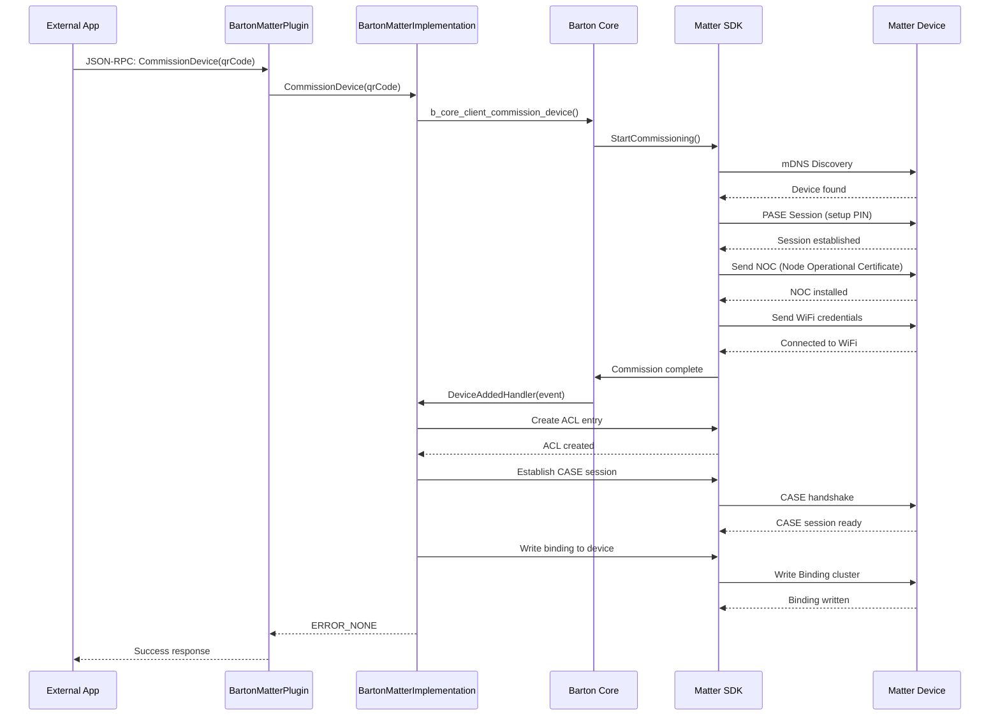
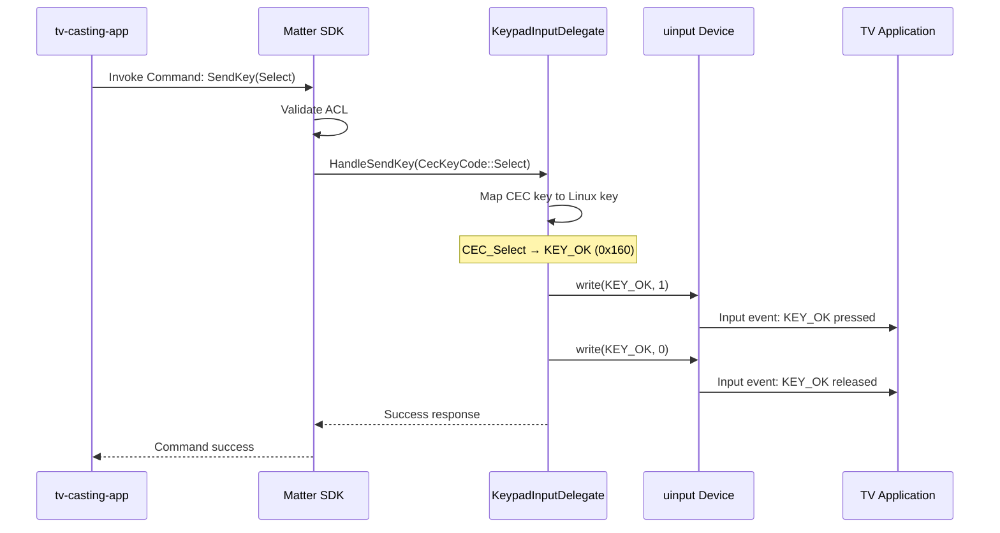
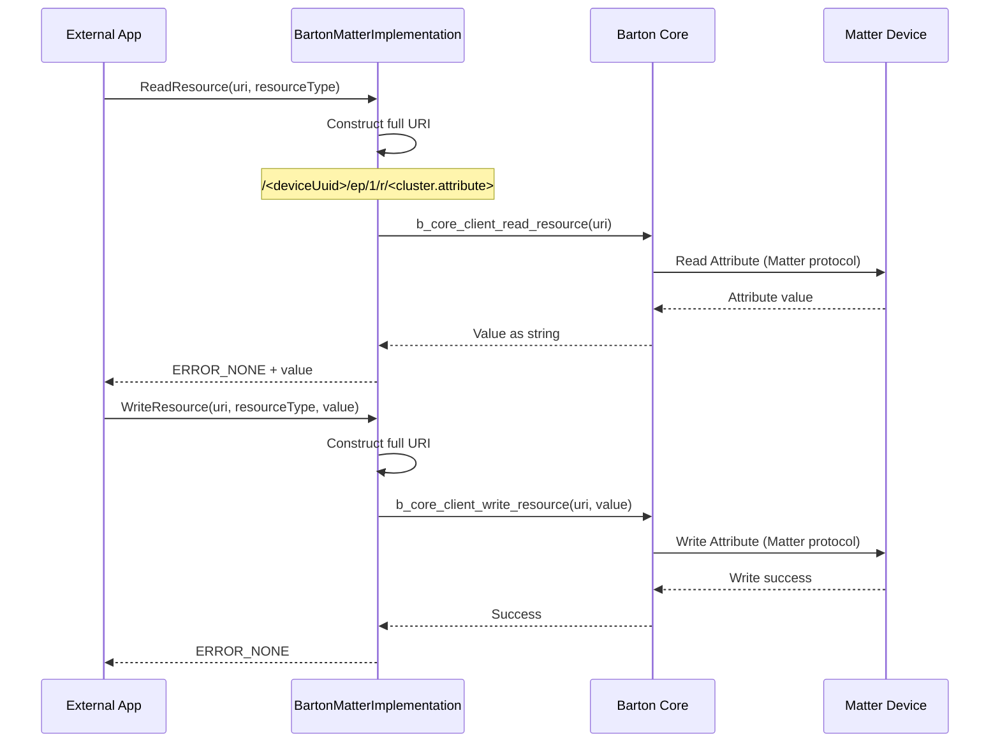

# BartonMatter Architecture Overview

## Table of Contents

1. [Introduction](#introduction)
2. [System Architecture](#system-architecture)
3. [Component Layers](#component-layers)
4. [Directory Structure](#directory-structure)
5. [Component Details](#component-details)
6. [Data Flow](#data-flow)
7. [Threading Model](#threading-model)
8. [Storage Architecture](#storage-architecture)
9. [Network Architecture](#network-architecture)
10. [Build System](#build-system)
11. [Dependencies](#dependencies)

---

## Introduction

BartonMatter is a Thunder (WPEFramework) plugin that brings Matter smart home protocol support to RDK devices (Smart TVs, Set-Top Boxes). It enables RDK devices to:

- **Act as Matter commissioners** - Commission and control Matter devices (lights, locks, sensors)
- **Act as Matter commissionees** - Be controlled by other Matter controllers (Alexa, Google Home)
- **Expose cluster delegates** - Handle incoming Matter commands (KeypadInput, ApplicationLauncher, MediaPlayback)

### Key Architecture Decisions

**Hybrid Approach**: Combines Barton Core library (GObject-based C) for commissioning with direct Matter SDK integration for cluster operations.

**Why Hybrid?**
- ✅ Barton Core provides stable commissioning APIs and device management
- ✅ Direct Matter SDK access gives full control over cluster delegates
- ✅ Avoids duplication - each component handles what it does best

---

## System Architecture

### High-Level Architecture Diagram

```
┌─────────────────────────────────────────────────────────────────┐
│                     External Applications                        │
│  ┌─────────────┐  ┌──────────────┐  ┌────────────────────┐    │
│  │  WebUI/REST │  │Thunder Client│  │ tv-casting-app     │    │
│  │  Interface  │  │  (JSON-RPC)  │  │ (Mobile App)       │    │
│  └──────┬──────┘  └──────┬───────┘  └──────┬─────────────┘    │
└─────────┼─────────────────┼──────────────────┼──────────────────┘
          │                 │                  │
          │                 │ JSON-RPC         │ Matter Protocol
          │                 │ Commands         │ (CASE Session)
          ▼                 ▼                  ▼
┌─────────────────────────────────────────────────────────────────┐
│                      Thunder Framework                           │
│  ┌────────────────────────────────────────────────────────────┐ │
│  │         BartonMatter Plugin (WPEFramework::Plugin)         │ │
│  │                                                            │ │
│  │  ┌──────────────────┐       ┌─────────────────────────┐  │ │
│  │  │BartonMatterPlugin│       │BartonMatterImplementation│ │ │
│  │  │                  │       │                          │ │ │
│  │  │• JSON-RPC Entry │───────▶│• IBartonMatter Interface│ │ │
│  │  │• Plugin Lifecycle│       │• 9 Public APIs          │ │ │
│  │  │• Interface Agg.  │       │• Event Handlers         │ │ │
│  │  └──────────────────┘       └────────┬────────────────┘  │ │
│  │                                       │                   │ │
│  └───────────────────────────────────────┼───────────────────┘ │
└────────────────────────────────────────────┼───────────────────┘
                                            │
                    ┌───────────────────────┼───────────────────────┐
                    │                       │                       │
                    ▼                       ▼                       ▼
        ┌──────────────────────┐ ┌─────────────────┐ ┌──────────────────────┐
        │   Barton Core C Lib  │ │ Matter Cluster  │ │  Matter SDK (Chip)   │
        │    (GObject-based)   │ │   Delegates     │ │                      │
        │                      │ │                 │ │                      │
        │• BCoreClient         │ │• KeypadInput    │ │• DeviceLayer         │
        │• Device Management   │ │• AppLauncher    │ │• AccessControl       │
        │• Commissioning       │ │• WiFiDriver     │ │• DataModel           │
        │• Resource R/W        │ │                 │ │• Crypto/Protocols    │
        │• Event System        │ │  (Singleton Mgr)│ │• NetworkProvisioning │
        └──────────┬───────────┘ └────────┬────────┘ └──────────┬───────────┘
                   │                      │                      │
                   └──────────────────────┼──────────────────────┘
                                          │
                                          ▼
                          ┌───────────────────────────────┐
                          │   Linux System Services       │
                          │                               │
                          │ • uinput (KeypadInput)        │
                          │ • Thunder REST API (AppLaunch)│
                          │ • WiFi/Network Stack          │
                          │ • Storage (/opt/.brtn-ds)     │
                          │ • GLib Event Loop             │
                          └───────────────────────────────┘
                                          │
                                          ▼
                          ┌───────────────────────────────┐
                          │    Matter Network Protocol    │
                          │                               │
                          │ • mDNS (Device Discovery)     │
                          │ • UDP/TCP (Matter over IP)    │
                          │ • Thread/WiFi                 │
                          │ • BLE (Commissioning)         │
                          └───────────────────────────────┘
                                          │
                                          ▼
                          ┌───────────────────────────────┐
                          │     Matter Ecosystem          │
                          │                               │
                          │ • Smart Lights                │
                          │ • Smart Locks                 │
                          │ • Sensors/Switches            │
                          │ • Other Controllers           │
                          └───────────────────────────────┘
```

---

## Component Layers

### Layer 1: External Interface Layer

**Thunder JSON-RPC Interface**
- Exposes 9 public APIs via `Exchange::IBartonMatter`
- Handles JSON-RPC command parsing and response formatting
- Validates inputs and converts between JSON and C++ types

**Matter Protocol Interface**
- Receives incoming Matter commands from controllers
- Routes commands to appropriate cluster delegates
- Sends responses and status updates

### Layer 2: Plugin Layer

**BartonMatterPlugin**
- Thunder plugin lifecycle management (Initialize, Deinitialize)
- JSON-RPC registration and dispatch
- Interface aggregation pattern (`INTERFACE_AGGREGATE`)
- Service registration with Thunder controller

**BartonMatterImplementation**
- Implements `Exchange::IBartonMatter` interface
- Business logic for all 9 public APIs
- Event handler registration and callbacks
- Bridge between Thunder C++ and Barton Core C

### Layer 3: Integration Layer

**Barton Core Library (C/GObject)**
- Device commissioning workflows (PASE, NOC exchange)
- Device database management (persistent storage)
- Resource read/write operations (Matter attribute access)
- Event system (device added/removed, endpoint added)
- Network credentials provider

**Matter Cluster Delegates (C++)**
- KeypadInput: CEC key to uinput translation
- ApplicationLauncher: Thunder REST API integration
- WiFiDriver: Network commissioning (OS-managed WiFi)
- Centralized management via `MatterClusterDelegateManager`

### Layer 4: SDK Layer

**Matter SDK (chip::)**
- Core Matter protocol stack
- Cluster implementations (OnOff, LevelControl, MediaPlayback, etc.)
- Access Control Lists (ACL) management
- Cryptographic operations (CASE, PASE sessions)
- Network layer (UDP, TCP, mDNS)
- Platform abstractions (DeviceLayer)

### Layer 5: System Layer

**Linux System Services**
- **uinput**: Virtual keyboard/remote device for KeypadInput
- **Thunder Application Service**: REST API for app lifecycle
- **Network Stack**: WiFi, Ethernet, Thread
- **File System**: Device database, certificates, keys
- **GLib**: Event loop, object system, type system

---

## Directory Structure

### Top-Level Structure

```
BartonCore/
└── BartonCore/
    └── entservices-connectivity/
        ├── BartonMatter/              # ← THIS PLUGIN
        ├── Bluetooth/                 # Bluetooth support
        ├── helpers/                   # Utility libraries
        ├── cmake/                     # CMake modules
        ├── build_dependencies.sh      # Build script
        ├── services.cmake             # Service definitions
        └── CMakeLists.txt             # Top-level build
```

### BartonMatter Plugin Structure

```
BartonMatter/
│
├── docs/                                    # Documentation
│   ├── ACL-and-Binding-Flow.md              # ACL/Binding explained
│   ├── Cluster-Delegates-Guide.md           # Delegates implementation
│   ├── Public-API-Reference.md              # API documentation
│   └── Architecture-Overview.md             # ← This file
│
├── BartonMatterPlugin.h                     # Plugin declaration
├── BartonMatterPlugin.cpp                   # Plugin implementation
│   ├── SERVICE_REGISTRATION macro
│   ├── Initialize() / Deinitialize()
│   └── JSON-RPC interface aggregation
│
├── BartonMatterImplementation.h             # API interface declaration
├── BartonMatterImplementation.cpp           # API implementation
│   ├── SetWifiCredentials()
│   ├── InitializeCommissioner()
│   ├── CommissionDevice()
│   ├── ReadResource() / WriteResource()
│   ├── ListDevices()
│   ├── GetCommissionedDeviceInfo()
│   ├── RemoveDevice()
│   ├── OpenCommissioningWindow()
│   ├── Event Handlers (DeviceAdded, DeviceRemoved, EndpointAdded)
│   └── ACL/Binding creation logic
│
├── MatterClusterDelegates.h                 # Delegate declarations
├── MatterClusterDelegates.cpp               # Delegate implementations
│   ├── MatterClusterDelegateManager         # Singleton manager
│   ├── KeypadInputDelegate                  # CEC → uinput
│   ├── ApplicationLauncherDelegate          # Thunder API integration
│   └── WiFiDriver                           # NetworkCommissioning
│
├── Module.h                                 # Thunder module header
├── Module.cpp                               # Thunder module registration
│
├── CMakeLists.txt                           # Build configuration
│   ├── Library compilation (BartonMatter.so)
│   ├── Barton Core linking
│   ├── Matter SDK linking
│   └── Dependency management
│
├── BartonMatter.conf.in                     # Config template
├── BartonMatter.config                      # Plugin configuration
│
├── README.md                                # Quick start guide
│
└── [Legacy docs - for reference]
    ├── API_Flow_Diagram.md
    ├── BartonMatter_Design_And_Flow.md
    └── DELEGATES_ACL_BINDINGS.md
```

### File Responsibilities

| File | Purpose | Key Contents |
|------|---------|--------------|
| **BartonMatterPlugin.cpp** | Plugin lifecycle | Thunder registration, interface aggregation |
| **BartonMatterImplementation.cpp** | Business logic | 9 public APIs, event handlers, ACL creation |
| **MatterClusterDelegates.cpp** | Cluster handling | KeypadInput, ApplicationLauncher, WiFiDriver |
| **Module.cpp** | Thunder module | Plugin metadata and initialization |
| **CMakeLists.txt** | Build system | Compilation, linking, dependencies |

---

## Component Details

### 1. BartonMatterPlugin

**Purpose**: Thunder plugin container and interface provider

**Key Classes**:
```cpp
class BartonMatter : public PluginHost::IPlugin,
                     public PluginHost::JSONRPC
{
    // Plugin lifecycle
    virtual const string Initialize(PluginHost::IShell* service);
    virtual void Deinitialize(PluginHost::IShell* service);

    // Interface aggregation
    INTERFACE_AGGREGATE(Exchange::IBartonMatter, mBartonMatter)

private:
    Exchange::IBartonMatter* mBartonMatter;  // Implementation instance
    PluginHost::IShell* mService;            // Thunder service
};
```

**Responsibilities**:
- Register plugin with Thunder framework (`SERVICE_REGISTRATION`)
- Create `BartonMatterImplementation` instance
- Expose `IBartonMatter` interface via aggregation
- Handle plugin activation/deactivation

### 2. BartonMatterImplementation

**Purpose**: Core business logic and API implementation

**Key Methods**:
```cpp
class BartonMatterImplementation : public Exchange::IBartonMatter
{
public:
    // Network Configuration
    Core::hresult SetWifiCredentials(string ssid, string password);

    // System Initialization
    Core::hresult InitializeCommissioner();

    // Device Commissioning
    Core::hresult CommissionDevice(string passcode);
    Core::hresult OpenCommissioningWindow(uint16_t timeout, string& info);

    // Device Management
    Core::hresult ListDevices(string& deviceList);
    Core::hresult GetCommissionedDeviceInfo(string& deviceInfo);
    Core::hresult RemoveDevice(string deviceUuid);

    // Resource Operations
    Core::hresult ReadResource(string uri, string resourceType, string& result);
    Core::hresult WriteResource(string uri, string resourceType, string value);

private:
    // Event Handlers
    static void DeviceAddedHandler(BCoreClient* client, BCoreDeviceAddedEvent* event, gpointer userData);
    static void DeviceRemovedHandler(BCoreClient* client, BCoreDeviceRemovedEvent* event, gpointer userData);
    static void EndpointAddedHandler(BCoreClient* client, BCoreEndpointAddedEvent* event, gpointer userData);

    // ACL Management
    bool ConfigureClientACL(string deviceUuid, uint16_t vendorId, uint16_t productId);
    bool AddACLEntryForClient(uint16_t vendorId, uint16_t productId, string deviceUuid);

    // Session Management
    void OnSessionEstablished(const chip::SessionHandle& sessionHandle);
    void OnSessionFailure(const chip::ScopedNodeId& peerId, CHIP_ERROR error);

    // Barton Core instance
    BCoreClient* bartonClient;

    // Caching
    std::map<std::string, std::string> commissionedDevicesCache;
    std::mutex devicesCacheMtx;
    bool devicesCacheInitialized;
};
```

**Key Features**:
- Thread-safe operations using mutexes
- Event-driven architecture with GLib callbacks
- Cache management for performance
- ACL auto-creation on device commissioning

### 3. MatterClusterDelegates

**Purpose**: Handle incoming Matter commands from controllers

**Architecture**:
```cpp
// Singleton manager owns all delegates
class MatterClusterDelegateManager
{
public:
    static MatterClusterDelegateManager& GetInstance();

    void Initialize();
    void InitializeNetworkCommissioning();

private:
    std::unique_ptr<KeypadInputDelegate> keypadInputDelegate;
    std::unique_ptr<ApplicationLauncherDelegate> appLauncherDelegate;
    std::unique_ptr<WiFiDriver> wifiDriver;
};

// Individual delegates
class KeypadInputDelegate : public chip::app::Clusters::KeypadInput::Delegate
{
    // CEC key → uinput translation
    void HandleSendKey(CommandResponseHelper<SendKeyResponseType>& helper,
                       CecKeyCode keyCode);
};

class ApplicationLauncherDelegate : public chip::app::Clusters::ApplicationLauncher::Delegate
{
    // Thunder REST API integration
    void HandleLaunchApp(CommandResponseHelper<LauncherResponseType>& helper,
                         const ByteSpan& data,
                         const ApplicationType& application);
};

class WiFiDriver : public chip::DeviceLayer::NetworkCommissioning::WiFiDriver
{
    // OS-managed WiFi (stub implementation)
    // Actual WiFi provisioning handled by NetworkManager/wpa_supplicant
};
```

**Delegate Flow**:
```
Matter Controller
    ↓ SendKey(CecKeyCode::Select)
KeypadInputDelegate
    ↓ Map CEC key to Linux key code
uinput Device
    ↓ KEY_OK event
Linux Input Subsystem
    ↓
TV Application receives key event
```

### 4. Barton Core Library

**Purpose**: C library providing Matter commissioning APIs

**Key Components**:
```c
// Client management
BCoreClient* b_core_client_new(BCoreInitializeParamsContainer* params);
gboolean b_core_client_start(BCoreClient* client);

// Device commissioning
gboolean b_core_client_commission_device(BCoreClient* client,
                                         const gchar* setupPayload,
                                         guint16 timeoutSeconds);

// Device management
GList* b_core_client_get_devices(BCoreClient* client);
gboolean b_core_client_remove_device(BCoreClient* client, const gchar* uuid);

// Resource operations
gchar* b_core_client_read_resource(BCoreClient* client,
                                   const gchar* uri,
                                   GError** error);
gboolean b_core_client_write_resource(BCoreClient* client,
                                      const gchar* uri,
                                      const gchar* value);

// Event signals (GObject signals)
g_signal_connect(client, "device-added", G_CALLBACK(DeviceAddedHandler), userData);
g_signal_connect(client, "device-removed", G_CALLBACK(DeviceRemovedHandler), userData);
g_signal_connect(client, "endpoint-added", G_CALLBACK(EndpointAddedHandler), userData);
```

**GObject Architecture**:
- Reference counting for memory management
- Signal/slot event system
- Type-safe property access
- Integration with GLib main loop

### 5. Matter SDK

**Purpose**: Core Matter protocol implementation

**Key Modules**:
```cpp
namespace chip {
    // Device layer
    namespace DeviceLayer {
        class PlatformMgr;         // Platform abstraction
        class ConfigurationMgr;    // Device configuration
        class ConnectivityMgr;     // Network management
    }

    // Access control
    namespace Access {
        class AccessControl;       // ACL management
        class Entry;               // ACL entry
    }

    // Data model
    namespace app {
        namespace Clusters {
            namespace OnOff { ... }
            namespace LevelControl { ... }
            namespace KeypadInput { ... }
            namespace ApplicationLauncher { ... }
        }
    }

    // Messaging
    namespace Messaging {
        class ExchangeManager;     // Message exchange
        class ExchangeContext;     // Exchange context
    }
}
```

---

## Data Flow

### Commissioning Flow



### Command Flow (KeypadInput Example)



### Resource Read/Write Flow



---

## Threading Model

### Thread Overview

```
┌─────────────────────────────────────────────────────────────┐
│                    Thunder Main Thread                       │
│                                                              │
│  • JSON-RPC request handling                                │
│  • Plugin lifecycle management                              │
│  • API method invocation                                    │
│  • Response serialization                                   │
└──────────────────┬──────────────────────────────────────────┘
                   │
                   ↓
┌─────────────────────────────────────────────────────────────┐
│                    GLib Main Loop Thread                     │
│                                                              │
│  • Barton Core event processing                             │
│  • DeviceAddedHandler, DeviceRemovedHandler callbacks       │
│  • GObject signal dispatch                                  │
│  • Timer and I/O event handling                             │
└──────────────────┬──────────────────────────────────────────┘
                   │
                   ↓
┌─────────────────────────────────────────────────────────────┐
│                  Matter SDK Thread Pool                      │
│                                                              │
│  • Matter protocol message processing                       │
│  • Network I/O (UDP/TCP)                                    │
│  • Cryptographic operations                                 │
│  • Cluster delegate invocations                             │
│  • ACL evaluation                                           │
└─────────────────────────────────────────────────────────────┘
```

### Synchronization Mechanisms

**Mutexes** (C++ std::mutex):
```cpp
// Protect WiFi credentials
std::mutex networkCredsMtx;

// Protect device cache
std::mutex devicesCacheMtx;

// Protect device URI map
std::mutex deviceUriMtx;
```

**Matter SDK Scheduling**:
```cpp
// Schedule work on Matter thread
chip::DeviceLayer::PlatformMgr().ScheduleWork([](intptr_t context) {
    // Runs on Matter thread
    MatterClusterDelegateManager::GetInstance().Initialize();
});
```

**GLib Callbacks** (automatically dispatched on GLib thread):
```cpp
g_signal_connect(bartonClient, "device-added",
                 G_CALLBACK(DeviceAddedHandler),
                 this);
```

### Thread Safety Best Practices

1. **API methods run on Thunder thread** - Keep operations fast
2. **Event handlers run on GLib thread** - Don't block
3. **Delegate methods run on Matter thread** - Matter SDK handles scheduling
4. **Use mutexes for shared state** - Credentials, caches, maps
5. **Avoid cross-thread calls without synchronization** - Use proper callbacks

---

## Storage Architecture

### File System Layout

```
/opt/.brtn-ds/                           # Main data directory
│
├── matter/                              # Matter SDK storage
│   ├── chip_counters.ini                # Persistent counters
│   ├── chip_config.ini                  # Matter configuration
│   └── chip_factory.ini                 # Factory data
│
├── storage/
│   └── devicedb/                        # Device database
│       ├── 90034FD9068DFF14/            # Device by NodeId (hex)
│       │   ├── device.db                # Device metadata
│       │   ├── noc.pem                  # Node Operational Certificate
│       │   └── session_keys             # Session keys
│       │
│       └── A1B2C3D4E5F67890/            # Another device
│           └── ...
│
└── config/                              # Plugin configuration
    └── commissioner.conf                # Commissioner settings
```

### Device Database Schema

**device.db** (per device):
```json
{
    "uuid": "90034FD9068DFF14",
    "nodeId": "90034FD9068DFF14",
    "fabricIndex": 1,
    "vendorId": 65521,
    "productId": 32768,
    "deviceClass": "tv-casting-app",
    "modelName": "tv-casting-app",
    "endpoints": [
        {
            "endpointId": 1,
            "deviceType": 35,  // Content App
            "clusters": [...]
        }
    ],
    "commissioned": 1735228800,  // Unix timestamp
    "lastSeen": 1735228900
}
```

### Storage Operations

**Read Operations**:
```cpp
// List all devices
GList* devices = b_core_client_get_devices(bartonClient);

// Get device info (scans devicedb directory)
void ScanDeviceDatabase() {
    DIR* dir = opendir("/opt/.brtn-ds/storage/devicedb");
    // Read each directory name as NodeId
    // Parse device.db for details
}
```

**Write Operations**:
```cpp
// Commission adds device entry
b_core_client_commission_device(bartonClient, setupPayload, timeout);
// → Creates /opt/.brtn-ds/storage/devicedb/<nodeId>/

// Remove deletes device entry
b_core_client_remove_device(bartonClient, deviceUuid);
// → Removes /opt/.brtn-ds/storage/devicedb/<nodeId>/
```

### Persistence Guarantees

- **Commissioned devices persist** across plugin restarts
- **ACL entries stored in Matter SDK** storage
- **Session keys cached** for fast reconnection
- **Credentials NOT persisted** - must be set via API each boot

---

## Network Architecture

### Protocol Stack

```
┌─────────────────────────────────────────────────────────────┐
│                    Application Layer                         │
│  • Public APIs (SetWifiCredentials, CommissionDevice, etc.)  │
└──────────────────┬──────────────────────────────────────────┘
                   │
┌──────────────────▼──────────────────────────────────────────┐
│                    Matter Layer                              │
│  • Interaction Model (IM)                                    │
│  • Cluster Commands/Attributes                               │
│  • ACL Enforcement                                           │
└──────────────────┬──────────────────────────────────────────┘
                   │
┌──────────────────▼──────────────────────────────────────────┐
│                   Security Layer                             │
│  • PASE (Password Authenticated Session Establishment)       │
│  • CASE (Certificate Authenticated Session Establishment)    │
│  • Group Key Management                                      │
└──────────────────┬──────────────────────────────────────────┘
                   │
┌──────────────────▼──────────────────────────────────────────┐
│                 Message Layer                                │
│  • Message Routing                                           │
│  • Reliable Messaging Protocol (MRP)                         │
│  • Message Counters                                          │
└──────────────────┬──────────────────────────────────────────┘
                   │
┌──────────────────▼──────────────────────────────────────────┐
│                 Transport Layer                              │
│  • UDP (primary)                                             │
│  • TCP (fallback for large messages)                         │
│  • BLE (commissioning only)                                  │
└──────────────────┬──────────────────────────────────────────┘
                   │
┌──────────────────▼──────────────────────────────────────────┐
│                 Network Layer                                │
│  • IPv6 (primary)                                            │
│  • IPv4 (dual-stack support)                                 │
│  • mDNS (service discovery)                                  │
│  • Thread / WiFi                                             │
└─────────────────────────────────────────────────────────────┘
```

### Network Ports

| Port | Protocol | Purpose |
|------|----------|---------|
| 5540 | UDP | Matter operational messages |
| 5540 | TCP | Matter operational messages (large) |
| 5353 | UDP | mDNS service discovery |
| Variable | BLE | Commissioning (Bluetooth LE) |

### Service Discovery

**mDNS Service Advertisement**:
```
_matter._tcp.local
_matterc._udp.local  (commissioning mode)

Example:
90034FD9068DFF14._matter._tcp.local
  TXT: VP=65521+32768  (VendorID+ProductID)
  TXT: D=3840          (Discriminator)
  Port: 5540
```

### Network Provisioning

**WiFi Provisioning Flow**:
```
1. Device commissioned via BLE
   └─ No network credentials yet

2. BartonMatter reads NetworkCommissioning cluster
   └─ Device supports WiFi

3. SetWifiCredentials() called
   └─ Credentials stored in memory

4. NetworkCommissioning cluster write
   └─ SSID and password sent to device

5. Device connects to WiFi
   └─ Operational over IP established
```

---

## Build System

### CMake Configuration

**Top-Level CMakeLists.txt**:
```cmake
set(PLUGIN_NAME BartonMatter)
set(MODULE_NAME ${NAMESPACE}${PLUGIN_NAME})

# Dependencies
find_package(${NAMESPACE}Plugins REQUIRED)
find_package(${NAMESPACE}Definitions REQUIRED)
find_package(PkgConfig REQUIRED)

# GLib/GObject
pkg_check_modules(GLIB REQUIRED glib-2.0 gobject-2.0)

# Barton Core
find_path(BARTON_INCLUDE_DIR NAMES barton-core-client.h)
find_library(BARTON_CORE_LIB NAMES BartonCore)

# Compile plugin
add_library(${MODULE_NAME} SHARED
    BartonMatterPlugin.cpp
    BartonMatterImplementation.cpp
    MatterClusterDelegates.cpp
    Module.cpp
)

# Link libraries
target_link_libraries(${MODULE_NAME}
    PRIVATE
        ${NAMESPACE}Plugins::${NAMESPACE}Plugins
        ${BARTON_CORE_LIB}
        ${GLIB_LIBRARIES}
        -lchip          # Matter SDK
        -ludev          # uinput
)

# Install
install(TARGETS ${MODULE_NAME}
    DESTINATION ${CMAKE_INSTALL_PREFIX}/lib/${NAMESPACE_LIB}/plugins
)
```

### Build Process

```bash
# 1. Configure
cmake -B build -S . \
    -DCMAKE_INSTALL_PREFIX=/usr \
    -DCMAKE_BUILD_TYPE=Release

# 2. Build
cmake --build build -j$(nproc)

# 3. Install
cmake --install build

# 4. Result
# → /usr/lib/wpeframework/plugins/libWPEFrameworkBartonMatter.so
```

### Compiler Flags

```cmake
# C++ Standard
set_target_properties(${MODULE_NAME} PROPERTIES
    CXX_STANDARD 17
    CXX_STANDARD_REQUIRED YES
)

# Warning suppression (for Matter SDK compatibility)
set(CMAKE_CXX_FLAGS "${CMAKE_CXX_FLAGS} -Wno-unused-variable")
```

---

## Dependencies

### External Libraries

| Library | Version | Purpose |
|---------|---------|---------|
| **Thunder/WPEFramework** | ≥4.0 | Plugin framework, JSON-RPC |
| **Barton Core** | ≥1.4.2.0 | Matter commissioning library |
| **Matter SDK** | 1.4.2.0 | Core Matter protocol |
| **GLib** | ≥2.56 | Event loop, object system |
| **GObject** | ≥2.56 | Type system for Barton Core |
| **libudev** | ≥239 | uinput device management |
| **OpenSSL** | ≥1.1.1 | Cryptography |

### Build Dependencies

```bash
# Ubuntu/Debian
apt-get install \
    libglib2.0-dev \
    libgobject-2.0-dev \
    libudev-dev \
    libssl-dev \
    cmake \
    ninja-build \
    pkg-config

# Barton Core (from source or package)
# Matter SDK (submodule or system install)
# Thunder Framework (from RDK build)
```

### Runtime Dependencies

```bash
# System libraries
ldd libWPEFrameworkBartonMatter.so
    libBartonCore.so => /usr/lib/libBartonCore.so
    libchip.so => /usr/lib/libchip.so
    libglib-2.0.so.0 => /lib/x86_64-linux-gnu/libglib-2.0.so.0
    libgobject-2.0.so.0 => /lib/x86_64-linux-gnu/libgobject-2.0.so.0
    libudev.so.1 => /lib/x86_64-linux-gnu/libudev.so.1
    libssl.so.1.1 => /usr/lib/x86_64-linux-gnu/libssl.so.1.1
```

### Interface Dependencies

**C++ Interfaces** (from Thunder):
```cpp
#include <interfaces/IBartonMatter.h>
#include <core/core.h>
#include <plugins/plugins.h>
```

**Barton Core Headers**:
```cpp
#include <barton-core-client.h>
#include <barton-core-properties.h>
#include <barton-core-commissioning-info.h>
#include <provider/barton-core-network-credentials-provider.h>
#include <events/barton-core-device-added-event.h>
```

**Matter SDK Headers**:
```cpp
#include <app/server/Server.h>
#include <access/AccessControl.h>
#include <app/clusters/keypad-input-server/keypad-input-server.h>
#include <app/clusters/application-launcher-server/application-launcher-server.h>
```

---

## Summary

BartonMatter is a sophisticated Thunder plugin that bridges multiple technologies:

- **Thunder Framework** for RDK integration and JSON-RPC interface
- **Barton Core** for stable Matter commissioning workflows
- **Matter SDK** for protocol implementation and cluster support
- **Linux system services** for device I/O and network management

The hybrid architecture leverages each component's strengths:
- Barton Core handles complex commissioning state machines
- Matter SDK provides full protocol compliance
- Custom delegates enable RDK-specific integrations (Thunder API, uinput)

The result is a production-ready Matter implementation that enables RDK devices to participate in the Matter ecosystem both as controllers (commissioning devices) and commissionees (being controlled by other Matter controllers).

---

## Related Documentation

- [Public API Reference](./Public-API-Reference.md) - All 9 public APIs
- [ACL and Binding Flow](./ACL-and-Binding-Flow.md) - Access control explained
- [Cluster Delegates Guide](./Cluster-Delegates-Guide.md) - Implementing delegates

---

## Version History

| Version | Date | Changes |
|---------|------|---------|
| 1.0 | 2025-12-26 | Initial architecture documentation |
