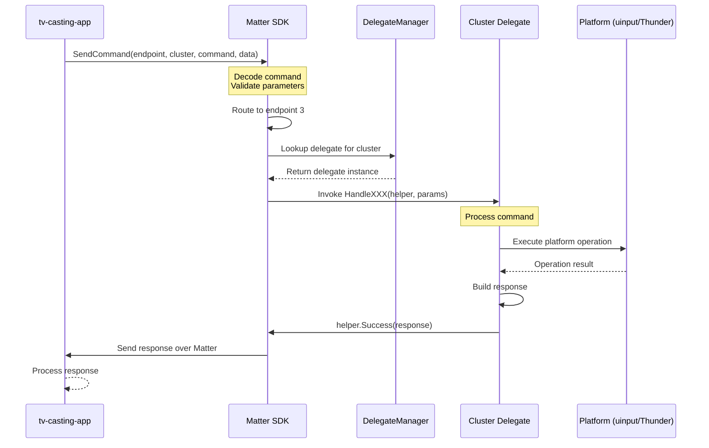
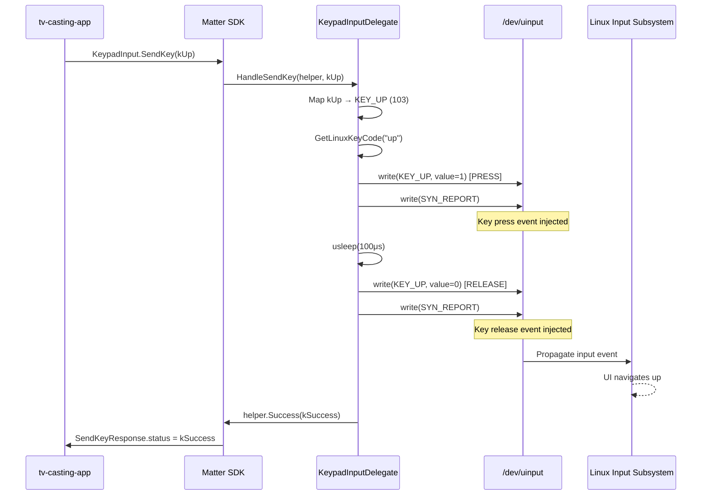
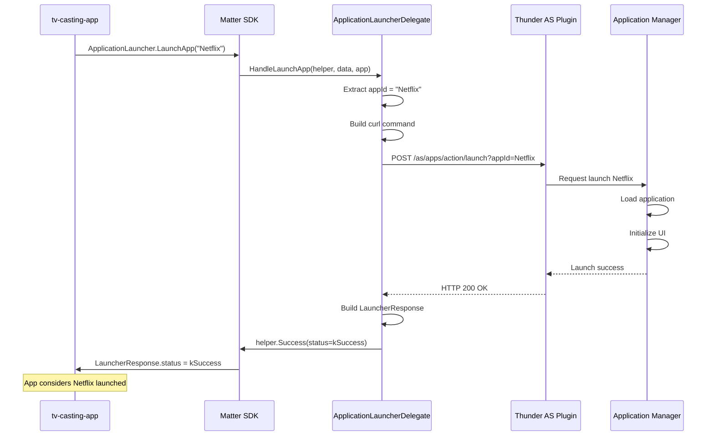
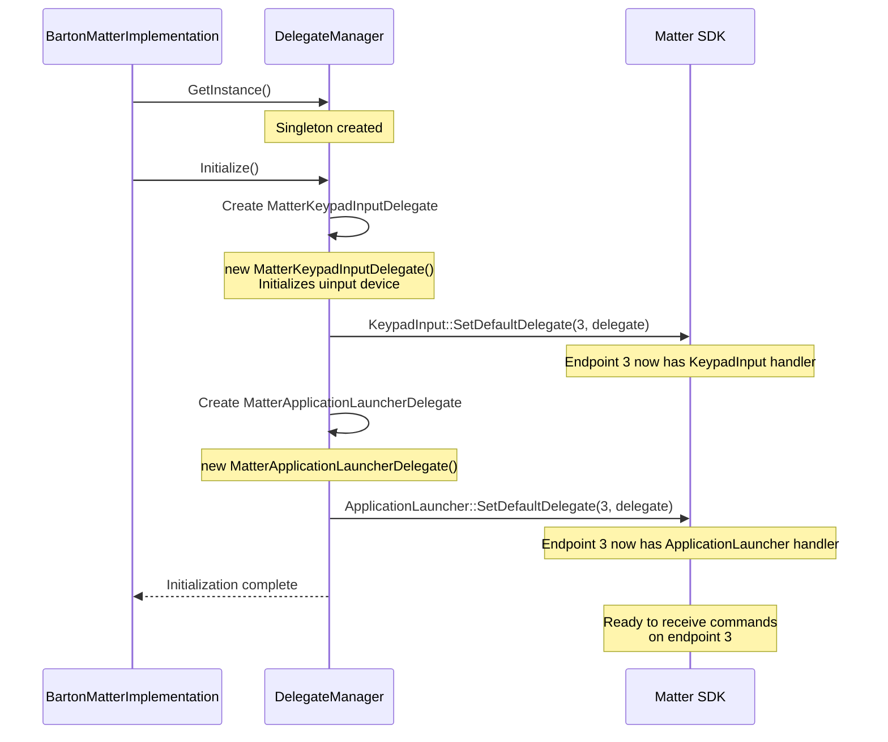

# Matter Cluster Delegates Implementation Guide

## Overview

This document explains how BartonMatter implements Matter cluster delegates to handle commands from tv-casting-apps. It covers existing implementations (KeypadInput and ApplicationLauncher), their architecture, and provides a step-by-step guide for adding new delegates.

---

## Table of Contents

1. [Layman's Explanation](#laymans-explanation)
2. [Technical Overview](#technical-overview)
3. [Architecture](#architecture)
4. [Existing Delegates](#existing-delegates)
   - [KeypadInput Delegate](#keypadinput-delegate)
   - [ApplicationLauncher Delegate](#applicationlauncher-delegate)
5. [Flow Diagrams](#flow-diagrams)
6. [Adding a New Delegate](#adding-a-new-delegate)
7. [Implementation Details](#implementation-details)
8. [Best Practices](#best-practices)
9. [Troubleshooting](#troubleshooting)

---

## Layman's Explanation

### What is a Delegate?

Think of a delegate as a **translator and executor** for remote commands. When a tv-casting-app (controller) sends a command to your TV, the delegate:

1. **Receives** the command (e.g., "Press the UP button")
2. **Translates** it into something the TV understands (Linux key code)
3. **Executes** it (injects the key press into the system)
4. **Responds** back to the controller with success or failure

### Real-World Analogy

```
🎮 tv-casting-app: "Press the UP arrow"
        ↓
📡 Matter SDK: "Received KeypadInput.SendKey(UP)"
        ↓
🔧 Delegate: "That's Linux key code 103, injecting via uinput"
        ↓
⌨️ System: "UP key pressed!"
        ↓
✅ Delegate: "Success! Sending confirmation to controller"
```

It's like having a smart assistant who:
- Understands multiple languages (Matter protocol)
- Knows how your house works (TV system APIs)
- Can actually flip switches and press buttons (execute commands)

### Why Delegates?

**Without Delegates:**
```
tv-casting-app → Matter SDK → ❌ No one to handle the command
TV just ignores it
```

**With Delegates:**
```
tv-casting-app → Matter SDK → ✅ Delegate catches it → TV responds!
```

Delegates are the **bridge between Matter's universal language and your TV's specific implementation**.

---

## Technical Overview

### Purpose

Matter cluster delegates implement server-side cluster command handlers. They:
- Receive cluster commands from Matter controllers
- Translate Matter-specific data structures to platform APIs
- Execute platform-specific operations
- Return Matter-compliant responses

### Delegate Pattern

```
┌─────────────────────────────────────────────────────────────────┐
│                      Matter Controller                          │
│                   (tv-casting-app Device)                       │
└───────────────────────────┬─────────────────────────────────────┘
                            │ SendKey(UP) Command
                            ↓
┌─────────────────────────────────────────────────────────────────┐
│                       Matter SDK Layer                          │
│  - Decodes command from network                                 │
│  - Validates parameters                                         │
│  - Routes to cluster endpoint                                   │
└───────────────────────────┬─────────────────────────────────────┘
                            │ Invoke Delegate
                            ↓
┌─────────────────────────────────────────────────────────────────┐
│                    MatterClusterDelegate                        │
│  - Receives typed command (CECKeyCodeEnum::kUp)                 │
│  - Translates to platform API (KEY_UP = 103)                    │
│  - Executes operation (uinput injection)                        │
│  - Returns response (SendKeyResponse::kSuccess)                 │
└───────────────────────────┬─────────────────────────────────────┘
                            │ Platform-Specific Call
                            ↓
┌─────────────────────────────────────────────────────────────────┐
│                      Platform Layer                             │
│  - uinput for key injection                                     │
│  - Thunder API for app management                               │
│  - System services                                              │
└─────────────────────────────────────────────────────────────────┘
```

### Key Concepts

- **Cluster**: A group of related functionality (e.g., KeypadInput cluster handles all remote control keys)
- **Command**: A specific action within a cluster (e.g., SendKey command within KeypadInput)
- **Delegate**: C++ class that implements cluster command handlers
- **Endpoint**: A logical device unit (e.g., Endpoint 3 = Content App with KeypadInput and ApplicationLauncher)
- **CommandResponseHelper**: Matter SDK utility for sending responses back to controllers

---

## Architecture

### Class Hierarchy

```
┌─────────────────────────────────────────────────────────────────┐
│          MatterClusterDelegateManager (Singleton)               │
│                                                                 │
│  Responsibilities:                                              │
│  - Create delegate instances                                    │
│  - Register delegates to endpoints                              │
│  - Manage delegate lifecycle                                    │
│  - Coordinate initialization/shutdown                           │
└───────────┬───────────────────────────────┬─────────────────────┘
            │                               │
            ↓                               ↓
┌───────────────────────────┐   ┌──────────────────────────────┐
│ MatterKeypadInputDelegate │   │MatterApplicationLauncherDelegate│
│                           │   │                              │
│ Inherits:                 │   │ Inherits:                    │
│  KeypadInput::Delegate    │   │  ApplicationLauncher::Delegate│
│                           │   │                              │
│ Commands:                 │   │ Commands:                    │
│  - HandleSendKey()        │   │  - HandleLaunchApp()         │
│                           │   │  - HandleStopApp()           │
│ Resources:                │   │  - HandleHideApp()           │
│  - uinput device (fd)     │   │                              │
│  - Key mapping table      │   │ Resources:                   │
└───────────────────────────┘   │  - Thunder API endpoints     │
                                └──────────────────────────────┘
```

### File Structure

```
BartonMatter/
├── MatterClusterDelegates.h        # Delegate class declarations
├── MatterClusterDelegates.cpp      # Delegate implementations
├── BartonMatterImplementation.cpp  # Main plugin (initializes manager)
└── docs/
    ├── ACL-and-Binding-Flow.md     # ACL/Binding documentation
    └── Cluster-Delegates-Guide.md  # This document
```

### Registration Flow

```cpp
// 1. Manager creation (singleton)
MatterClusterDelegateManager& manager = MatterClusterDelegateManager::GetInstance();

// 2. Initialize (creates delegates)
manager.Initialize();
  ├─ Creates MatterKeypadInputDelegate instance
  ├─ Registers to KeypadInput::SetDefaultDelegate(endpoint=3)
  ├─ Creates MatterApplicationLauncherDelegate instance
  └─ Registers to ApplicationLauncher::SetDefaultDelegate(endpoint=3)

// 3. Runtime (commands arrive)
tv-casting-app sends command → Matter SDK routes to endpoint 3 → Delegate handles it

// 4. Shutdown (cleanup)
manager.Shutdown();
  ├─ Unregisters delegates (SetDefaultDelegate(nullptr))
  └─ Destroys delegate instances (unique_ptr cleanup)
```

---

## Existing Delegates

### KeypadInput Delegate

#### Purpose
Handles remote control key presses from tv-casting-apps by injecting Linux key events via the uinput subsystem.

#### Cluster Information
- **Cluster ID**: 0x0509 (KeypadInput)
- **Specification**: Matter Application Cluster Specification 6.8
- **Endpoint**: 3 (Content App)

#### Commands Handled

| Command | ID | Description | Response |
|---------|-----|-------------|----------|
| SendKey | 0x00 | Send a single key press | SendKeyResponse (status) |

#### CEC Key Code Mapping

The delegate maps Matter CEC key codes to Linux input key codes:

| Matter CEC Key | Linux Key Code | System Action |
|----------------|----------------|---------------|
| kUp | KEY_UP (103) | Navigate up |
| kDown | KEY_DOWN (108) | Navigate down |
| kLeft | KEY_LEFT (105) | Navigate left |
| kRight | KEY_RIGHT (106) | Navigate right |
| kSelect | KEY_ENTER (28) | Confirm selection |
| kVolumeUp | KEY_KPPLUS (78) | Increase volume |
| kVolumeDown | KEY_KPMINUS (74) | Decrease volume |
| kChannelUp | CTRL + UP | Change channel up |
| kChannelDown | CTRL + DOWN | Change channel down |
| kPlay | KEY_F11 (87) | Start playback |
| kPause | KEY_F11 (87) | Pause playback |
| kRewind | KEY_F10 (68) | Rewind content |
| kFastForward | KEY_F12 (88) | Fast forward content |

**Full mapping**: See `GetLinuxKeyCode()` method in implementation.

#### Implementation Details

##### Initialization
```cpp
MatterKeypadInputDelegate::MatterKeypadInputDelegate()
{
    // Open /dev/uinput for key injection
    mUinputFd = open("/dev/uinput", O_WRONLY | O_NONBLOCK);

    // Enable key event types
    ioctl(mUinputFd, UI_SET_EVBIT, EV_KEY);
    ioctl(mUinputFd, UI_SET_EVBIT, EV_SYN);

    // Enable specific key codes
    ioctl(mUinputFd, UI_SET_KEYBIT, KEY_UP);
    // ... (repeated for all supported keys)

    // Setup virtual device
    struct uinput_setup usetup;
    usetup.id.bustype = BUS_VIRTUAL;
    usetup.id.vendor = 0x27d6;  // Matter vendor
    usetup.id.product = 0x6d74; // 'mt' for Matter
    strcpy(usetup.name, "matter-key-injector");

    ioctl(mUinputFd, UI_DEV_SETUP, &usetup);
    ioctl(mUinputFd, UI_DEV_CREATE);
}
```

##### Command Handling
```cpp
void HandleSendKey(CommandResponseHelper<SendKeyResponse> & helper,
                   const CECKeyCodeEnum & keyCode)
{
    // 1. Map CEC key code to Linux key code
    const char* keyName = MapCECKeyToName(keyCode);
    int linuxKeyCode = GetLinuxKeyCode(keyName);

    // 2. Check if modifier key needed (e.g., CTRL for channel)
    if (keyCode == kChannelUp) {
        SendKeyWithModifier(KEY_LEFTCTRL, KEY_UP);
    } else {
        SendKeyEvent(linuxKeyCode);
    }

    // 3. Send response
    SendKeyResponse response;
    response.status = StatusEnum::kSuccess;
    helper.Success(response);
}
```

##### Key Event Injection
```cpp
void SendKeyEvent(int linuxKeyCode)
{
    struct input_event ev;

    // Press
    ev.type = EV_KEY;
    ev.code = linuxKeyCode;
    ev.value = 1;  // Key down
    write(mUinputFd, &ev, sizeof(ev));

    // Sync
    ev.type = EV_SYN;
    ev.code = SYN_REPORT;
    write(mUinputFd, &ev, sizeof(ev));

    usleep(100);  // 0.1ms delay

    // Release
    ev.value = 0;  // Key up
    write(mUinputFd, &ev, sizeof(ev));

    // Sync
    ev.type = EV_SYN;
    write(mUinputFd, &ev, sizeof(ev));
}
```

#### Feature Map

```cpp
uint32_t GetFeatureMap(EndpointId endpoint)
{
    // Bit 0: NavigationKeyCodes (UP, DOWN, LEFT, RIGHT, SELECT, BACK)
    // Bit 1: LocationKeys (Settings, Home, Menu, etc.)
    // Bit 2: NumberKeys (0-9)
    return 0x07;  // All features enabled
}
```

#### Error Handling

| Error Condition | Handling | Response |
|----------------|----------|----------|
| uinput not initialized | Log error, skip injection | kSuccess (graceful degradation) |
| Unknown CEC key code | Log warning, send default | kSuccess |
| uinput write failure | Log error, continue | kSuccess |

**Design Decision**: Returns success even on errors to avoid breaking tv-casting-app experience. Errors are logged for debugging.

---

### ApplicationLauncher Delegate

#### Purpose
Manages application lifecycle (launch, stop, hide) by interfacing with the Thunder Application Service (AS) plugin.

#### Cluster Information
- **Cluster ID**: 0x050C (ApplicationLauncher)
- **Specification**: Matter Application Cluster Specification 6.4
- **Endpoint**: 3 (Content App)

#### Commands Handled

| Command | ID | Description | Response |
|---------|-----|-------------|----------|
| LaunchApp | 0x00 | Launch application by ID | LauncherResponse (status + data) |
| StopApp | 0x01 | Stop running application | LauncherResponse (status) |
| HideApp | 0x02 | Hide/minimize application | LauncherResponse (status) |

#### Application Structure

```cpp
struct ApplicationStruct {
    uint16_t catalogVendorID;   // Vendor identifier (0 = CSA spec)
    ByteSpan applicationID;      // App ID (e.g., "Netflix", "YouTube")
}
```

#### Implementation Details

##### Launch App Flow

```cpp
void HandleLaunchApp(CommandResponseHelper<LauncherResponse> & helper,
                     const ByteSpan & data,
                     const ApplicationStruct & application)
{
    // 1. Extract application ID
    string appId(reinterpret_cast<const char*>(application.applicationID.data()),
                 application.applicationID.size());

    // 2. Build Thunder API command
    string cmd = "curl -X POST \"http://127.0.0.1:9005/as/apps/action/launch"
                 "?appId=" + appId + "\" -d '' 2>&1";

    // 3. Execute command
    FILE* pipe = popen(cmd.c_str(), "r");
    int exitCode = pclose(pipe);

    // 4. Build response
    LauncherResponse response;
    response.status = (exitCode == 0) ? StatusEnum::kSuccess
                                        : StatusEnum::kSystemBusy;

    helper.Success(response);
}
```

##### Thunder Application Service API

The delegate communicates with Thunder AS plugin via REST API:

| Endpoint | Method | Purpose | Parameters |
|----------|--------|---------|------------|
| `/as/apps/action/launch` | POST | Launch app | `appId` (query param) |
| `/as/apps/action/close` | POST | Close app | `appId` (query param) |
| `/as/apps/action/suspend` | POST | Hide/suspend app | `appId` (query param) |

**Example curl command:**
```bash
curl -X POST "http://127.0.0.1:9005/as/apps/action/launch?appId=Netflix" -d ''
```

##### Stop App Flow

```cpp
void HandleStopApp(CommandResponseHelper<LauncherResponse> & helper,
                   const ApplicationStruct & application)
{
    // Extract app ID
    string appId = ExtractAppId(application);

    // Build close command
    string cmd = "curl -X POST \"http://127.0.0.1:9005/as/apps/action/close"
                 "?appId=" + appId + "\" -d '' 2>&1";

    // Execute and respond
    ExecuteAndRespond(cmd, helper);
}
```

##### Hide App Flow

```cpp
void HandleHideApp(CommandResponseHelper<LauncherResponse> & helper,
                   const ApplicationStruct & application)
{
    // Currently returns success without implementation
    // TODO: Integrate with Thunder suspend/hide API

    LauncherResponse response;
    response.status = StatusEnum::kSuccess;
    helper.Success(response);
}
```

#### Catalog Support

```cpp
CHIP_ERROR HandleGetCatalogList(AttributeValueEncoder & encoder)
{
    // Return list of supported catalog vendor IDs
    return encoder.EncodeList([](const auto & listEncoder) {
        // 0 = CSA specification (universal app IDs)
        listEncoder.Encode(static_cast<uint16_t>(0));
        return CHIP_NO_ERROR;
    });
}
```

#### Status Codes

| Matter Status | Value | Meaning | When Used |
|---------------|-------|---------|-----------|
| kSuccess | 0x00 | Operation successful | App launched/stopped successfully |
| kAppNotAvailable | 0x01 | App not found | Invalid app ID |
| kSystemBusy | 0x02 | System busy or error | Thunder API call failed |

#### Error Handling

| Error Condition | Handling | Response Status |
|----------------|----------|-----------------|
| Invalid app ID | Log error | kAppNotAvailable |
| Thunder API timeout | Log error | kSystemBusy |
| popen() failure | Log error | kSystemBusy |
| curl command failure | Log error + output | kSystemBusy |

---

## Flow Diagrams

### Overall Delegate Invocation Flow



### KeypadInput SendKey Flow



### ApplicationLauncher LaunchApp Flow



### Delegate Registration (Initialization)



---

## Adding a New Delegate

### Step-by-Step Guide

#### Step 1: Choose Your Cluster

Identify the Matter cluster you want to implement. Common clusters:

| Cluster Name | ID | Purpose | Typical Commands |
|-------------|-----|---------|------------------|
| OnOff | 0x0006 | Power control | On, Off, Toggle |
| LevelControl | 0x0008 | Dimming/Volume | MoveToLevel, Move, Step |
| MediaPlayback | 0x0506 | Media control | Play, Pause, Seek |
| ContentLauncher | 0x050A | Content search | LaunchContent, LaunchURL |
| AudioOutput | 0x050B | Audio routing | SelectOutput |

**Example**: Let's implement **MediaPlayback** cluster.

#### Step 2: Define Delegate Class (Header)

Add to `MatterClusterDelegates.h`:

```cpp
/**
 * @brief MediaPlayback delegate for handling media playback commands
 *
 * Implements the Matter MediaPlayback cluster delegate interface to handle
 * Play, Pause, Stop, Seek, and other media control commands from tv-casting-apps.
 */
class MatterMediaPlaybackDelegate : public chip::app::Clusters::MediaPlayback::Delegate
{
public:
    MatterMediaPlaybackDelegate();
    virtual ~MatterMediaPlaybackDelegate() = default;

    /**
     * @brief Handle Play command
     *
     * @param helper CommandResponseHelper for sending response
     */
    void HandlePlay(chip::app::CommandResponseHelper<chip::app::Clusters::MediaPlayback::Commands::PlaybackResponse::Type> & helper) override;

    /**
     * @brief Handle Pause command
     *
     * @param helper CommandResponseHelper for sending response
     */
    void HandlePause(chip::app::CommandResponseHelper<chip::app::Clusters::MediaPlayback::Commands::PlaybackResponse::Type> & helper) override;

    /**
     * @brief Handle Stop command
     *
     * @param helper CommandResponseHelper for sending response
     */
    void HandleStop(chip::app::CommandResponseHelper<chip::app::Clusters::MediaPlayback::Commands::PlaybackResponse::Type> & helper) override;

    /**
     * @brief Handle Seek command
     *
     * @param helper CommandResponseHelper for sending response
     * @param position Position in milliseconds
     */
    void HandleSeek(chip::app::CommandResponseHelper<chip::app::Clusters::MediaPlayback::Commands::PlaybackResponse::Type> & helper,
                    uint64_t position) override;

    // Attribute getters (if cluster has attributes)
    chip::app::Clusters::MediaPlayback::PlaybackStateEnum GetCurrentState() override;
    uint64_t GetStartTime() override;
    uint64_t GetDuration() override;

private:
    // Your platform-specific state
    chip::app::Clusters::MediaPlayback::PlaybackStateEnum mCurrentState;
    uint64_t mStartTime;
    uint64_t mDuration;
};
```

#### Step 3: Update Manager Class (Header)

Add member variable in `MatterClusterDelegateManager`:

```cpp
class MatterClusterDelegateManager
{
public:
    // ... existing methods ...

private:
    // ... existing members ...
    std::unique_ptr<MatterMediaPlaybackDelegate> mMediaPlaybackDelegate;  // NEW
};
```

#### Step 4: Implement Delegate (Source)

Add to `MatterClusterDelegates.cpp`:

```cpp
// MatterMediaPlaybackDelegate Implementation

MatterMediaPlaybackDelegate::MatterMediaPlaybackDelegate()
    : mCurrentState(MediaPlayback::PlaybackStateEnum::kStopped)
    , mStartTime(0)
    , mDuration(0)
{
    ChipLogProgress(AppServer, "MatterMediaPlaybackDelegate created");
}

void MatterMediaPlaybackDelegate::HandlePlay(
    CommandResponseHelper<MediaPlayback::Commands::PlaybackResponse::Type> & helper)
{
    ChipLogProgress(AppServer, "HandlePlay command received");

    // TODO: Integrate with your platform's media player API
    // Example: Send key event, call Thunder API, etc.

    // For now, simulate success
    mCurrentState = MediaPlayback::PlaybackStateEnum::kPlaying;

    MediaPlayback::Commands::PlaybackResponse::Type response;
    response.status = MediaPlayback::StatusEnum::kSuccess;
    response.data = chip::Optional<chip::CharSpan>();  // Optional debug data

    helper.Success(response);
    ChipLogProgress(AppServer, "Media playback started");
}

void MatterMediaPlaybackDelegate::HandlePause(
    CommandResponseHelper<MediaPlayback::Commands::PlaybackResponse::Type> & helper)
{
    ChipLogProgress(AppServer, "HandlePause command received");

    // TODO: Send pause command to media player
    mCurrentState = MediaPlayback::PlaybackStateEnum::kPaused;

    MediaPlayback::Commands::PlaybackResponse::Type response;
    response.status = MediaPlayback::StatusEnum::kSuccess;
    helper.Success(response);
}

void MatterMediaPlaybackDelegate::HandleStop(
    CommandResponseHelper<MediaPlayback::Commands::Type> & helper)
{
    ChipLogProgress(AppServer, "HandleStop command received");

    // TODO: Send stop command to media player
    mCurrentState = MediaPlayback::PlaybackStateEnum::kStopped;
    mStartTime = 0;

    MediaPlayback::Commands::PlaybackResponse::Type response;
    response.status = MediaPlayback::StatusEnum::kSuccess;
    helper.Success(response);
}

void MatterMediaPlaybackDelegate::HandleSeek(
    CommandResponseHelper<MediaPlayback::Commands::PlaybackResponse::Type> & helper,
    uint64_t position)
{
    ChipLogProgress(AppServer, "HandleSeek to position %llu ms", position);

    // TODO: Send seek command to media player with position
    mStartTime = position;

    MediaPlayback::Commands::PlaybackResponse::Type response;
    response.status = MediaPlayback::StatusEnum::kSuccess;
    helper.Success(response);
}

// Attribute getters
MediaPlayback::PlaybackStateEnum MatterMediaPlaybackDelegate::GetCurrentState()
{
    return mCurrentState;
}

uint64_t MatterMediaPlaybackDelegate::GetStartTime()
{
    return mStartTime;
}

uint64_t MatterMediaPlaybackDelegate::GetDuration()
{
    return mDuration;
}
```

#### Step 5: Register Delegate (Manager)

Update `MatterClusterDelegateManager::Initialize()`:

```cpp
void MatterClusterDelegateManager::Initialize()
{
    if (mInitialized)
    {
        return;
    }

    // ... existing KeypadInput and ApplicationLauncher registration ...

    // Create MediaPlayback delegate (NEW)
    mMediaPlaybackDelegate = std::make_unique<MatterMediaPlaybackDelegate>();

    // Register delegate for MediaPlayback cluster on endpoint 1 (Video Player)
    MediaPlayback::SetDefaultDelegate(1, mMediaPlaybackDelegate.get());
    mRegisteredEndpoints.push_back(1);

    mInitialized = true;
    ChipLogProgress(AppServer, "All cluster delegates registered");
}
```

#### Step 6: Unregister on Shutdown

Update `MatterClusterDelegateManager::Shutdown()`:

```cpp
void MatterClusterDelegateManager::Shutdown()
{
    if (!mInitialized)
    {
        return;
    }

    // Unregister delegates
    for (chip::EndpointId ep : mRegisteredEndpoints)
    {
        KeypadInput::SetDefaultDelegate(ep, nullptr);
        ApplicationLauncher::SetDefaultDelegate(ep, nullptr);
        MediaPlayback::SetDefaultDelegate(ep, nullptr);  // NEW
    }
    mRegisteredEndpoints.clear();

    // Cleanup delegates (automatic via unique_ptr)
    mKeypadInputDelegate.reset();
    mApplicationLauncherDelegate.reset();
    mMediaPlaybackDelegate.reset();  // NEW

    mInitialized = false;
}
```

#### Step 7: Update ZAP Configuration

Ensure your endpoint has the cluster enabled in `barton.zap`:

```json
{
  "endpointId": 1,
  "endpointType": "MA-videoplayer",
  "clusters": [
    {
      "name": "Media Playback",
      "code": 1286,
      "side": "server",
      "enabled": 1,
      "commands": [
        {
          "name": "Play",
          "code": 0,
          "incoming": 1,
          "outgoing": 0
        },
        {
          "name": "Pause",
          "code": 1,
          "incoming": 1,
          "outgoing": 0
        }
        // ... other commands ...
      ],
      "attributes": [
        {
          "name": "CurrentState",
          "code": 0,
          "side": "server",
          "type": "PlaybackStateEnum",
          "included": 1
        }
        // ... other attributes ...
      ]
    }
  ]
}
```

#### Step 8: Build and Test

```bash
# Build
bitbake entservices-connectivity

# Deploy to device
scp build/libWPEFrameworkBartonMatter.so device:/usr/lib/

# Restart Thunder
ssh device "systemctl restart wpeframework"

# Test with matter-cli or tv-casting-app
matter-cli interactive start
> mediaplayback play 1  # endpoint 1
```

---

## Implementation Details

### CommandResponseHelper Pattern

All command handlers receive a `CommandResponseHelper` which manages the response lifecycle:

```cpp
void HandleXXXCommand(
    CommandResponseHelper<Commands::XXXResponse::Type> & helper,
    /* command parameters */)
{
    // 1. Process command
    ProcessCommand(params);

    // 2. Build response
    Commands::XXXResponse::Type response;
    response.status = StatusEnum::kSuccess;
    response.data = OptionalData();

    // 3. Send response (automatically handles encoding and transmission)
    helper.Success(response);

    // Alternative for errors:
    // helper.Failure(Protocols::InteractionModel::Status::Failure);
}
```

### Attribute Handling

Some clusters have attributes (read-only or read-write) that controllers can query:

```cpp
// Define attribute getter in delegate
uint32_t GetFeatureMap(EndpointId endpoint) override
{
    return 0x07;  // Return feature bits
}

// Matter SDK automatically calls getters when attributes are read
// No explicit registration needed - override methods in delegate base class
```

### Status Codes

Each cluster defines its own status codes. Common ones:

| Status | Value | Meaning |
|--------|-------|---------|
| Success | 0x00 | Command executed successfully |
| InvalidCommand | 0x01 | Command not supported or invalid |
| InvalidState | 0x02 | Command not valid in current state |
| NotAllowed | 0x03 | Not authorized or allowed |

**Check cluster specification for exact status codes!**

### Threading Considerations

- **Delegates run on Matter event loop thread** - Keep operations fast
- **For long operations**: Use `DeviceLayer::PlatformMgr().ScheduleWork()` to defer
- **Thread safety**: Protect shared state with mutexes if accessed from multiple threads

Example:
```cpp
void HandleSlowCommand(CommandResponseHelper<Response> & helper)
{
    // Capture helper and params
    auto helperPtr = std::make_shared<CommandResponseHelper<Response>>(std::move(helper));

    // Schedule work on separate thread
    chip::DeviceLayer::PlatformMgr().ScheduleWork([helperPtr](intptr_t context) {
        // Long operation here
        PerformSlowOperation();

        // Send response
        Response resp;
        resp.status = StatusEnum::kSuccess;
        helperPtr->Success(resp);
    });
}
```

### Memory Management

- **Delegates owned by Manager**: Use `std::unique_ptr` for automatic cleanup
- **No manual new/delete**: Let smart pointers handle lifecycle
- **String handling**: Use `chip::CharSpan` for zero-copy string views
- **Buffer management**: Use `chip::ByteSpan` for binary data

---

## Best Practices

### 1. Logging

Use Matter SDK logging macros:

```cpp
ChipLogProgress(AppServer, "Operation successful: %s", detail);
ChipLogError(AppServer, "Operation failed: error=0x%x", errorCode);
ChipLogDetail(AppServer, "Detailed info: value=%d", value);
```

**Log Levels**:
- `ChipLogError`: Errors that prevent operation
- `ChipLogProgress`: Important milestones
- `ChipLogDetail`: Verbose debugging info

### 2. Error Handling

Always respond, even on errors:

```cpp
void HandleCommand(CommandResponseHelper<Response> & helper)
{
    try {
        // Attempt operation
        PerformOperation();

        Response resp;
        resp.status = StatusEnum::kSuccess;
        helper.Success(resp);
    }
    catch (const std::exception& e) {
        ChipLogError(AppServer, "Exception: %s", e.what());

        // Still respond with error status
        Response resp;
        resp.status = StatusEnum::kFailure;
        helper.Success(resp);
    }
}
```

### 3. State Management

Track delegate state to provide accurate attribute values:

```cpp
class MatterXXXDelegate : public XXX::Delegate
{
private:
    State mCurrentState;  // Track current state
    std::mutex mStateMutex;  // Protect concurrent access

public:
    void HandleCommand(...)
    {
        std::lock_guard<std::mutex> lock(mStateMutex);
        mCurrentState = NewState;
    }

    State GetCurrentState() override
    {
        std::lock_guard<std::mutex> lock(mStateMutex);
        return mCurrentState;
    }
};
```

### 4. Platform Integration

Isolate platform-specific code:

```cpp
class MatterXXXDelegate : public XXX::Delegate
{
private:
    // Platform interface (abstract)
    class IPlatformInterface {
    public:
        virtual void DoOperation() = 0;
    };

    // Thunder implementation
    class ThunderInterface : public IPlatformInterface {
        void DoOperation() override {
            // Thunder-specific code
        }
    };

    std::unique_ptr<IPlatformInterface> mPlatform;

public:
    void HandleCommand(...)
    {
        // Delegate to platform layer
        mPlatform->DoOperation();
    }
};
```

### 5. Testing

Create unit tests for delegates:

```cpp
TEST(MatterDelegateTest, HandlePlayCommand)
{
    MatterMediaPlaybackDelegate delegate;

    // Mock response helper
    MockCommandResponseHelper<PlaybackResponse> helper;

    // Call handler
    delegate.HandlePlay(helper);

    // Verify response
    EXPECT_EQ(helper.GetStatus(), StatusEnum::kSuccess);
    EXPECT_EQ(delegate.GetCurrentState(), PlaybackStateEnum::kPlaying);
}
```

### 6. Documentation

Document your delegate:

```cpp
/**
 * @brief XXX delegate for handling YYY functionality
 *
 * Implements the Matter XXX cluster (ID 0xABCD) delegate interface.
 * Routes commands to the Thunder ZZZ plugin.
 *
 * Supported Commands:
 * - Command1: Does X
 * - Command2: Does Y
 *
 * Platform Integration:
 * - Uses Thunder API endpoint /path/to/api
 * - Requires ZZZ plugin to be active
 *
 * @note This delegate runs on Matter event loop thread. Long operations
 *       should be scheduled via PlatformMgr().ScheduleWork().
 */
class MatterXXXDelegate : public XXX::Delegate
{
    // ...
};
```

---

## Troubleshooting

### Issue: Delegate Not Invoked

**Symptoms**: Commands sent from tv-casting-app, but delegate handler never called.

**Diagnosis**:
```bash
# Check Matter logs
journalctl -u wpeframework | grep "HandleXXX"

# Verify endpoint configuration
matter-cli descriptor read-server-list <endpoint>

# Check delegate registration
# Add debug log in Initialize():
ChipLogProgress(AppServer, "Registered XXX delegate on endpoint %d", ep);
```

**Solutions**:
1. Verify cluster enabled in ZAP file
2. Check endpoint ID matches registration
3. Ensure `Initialize()` called during plugin startup
4. Rebuild ZAP-generated code if cluster config changed

---

### Issue: Response Not Sent

**Symptoms**: Command processed, but tv-casting-app reports timeout.

**Diagnosis**:
```bash
# Check for exceptions
journalctl -u wpeframework | grep "Exception\|Error"

# Verify helper.Success() called
# Add debug log before response:
ChipLogProgress(AppServer, "Sending response: status=%d", response.status);
```

**Solutions**:
1. Always call `helper.Success()` or `helper.Failure()`
2. Don't throw exceptions without catching
3. Don't move/copy `CommandResponseHelper` (it's move-only)
4. Call response method exactly once

---

### Issue: Platform Operation Fails

**Symptoms**: Delegate invoked, but platform API (Thunder, uinput) fails.

**Diagnosis**:
```bash
# Check platform service status
systemctl status wpeframework
systemctl status <your-service>

# Test platform API directly
curl -X POST "http://127.0.0.1:9005/your/api/endpoint"

# Check file descriptor validity
ls -la /dev/uinput  # For KeypadInput
```

**Solutions**:
1. Verify platform service is running
2. Check API endpoint URLs and parameters
3. Validate file permissions (uinput requires write access)
4. Handle platform errors gracefully (return appropriate status)

---

### Issue: Memory Leak

**Symptoms**: Memory usage grows over time.

**Diagnosis**:
```bash
# Use valgrind
valgrind --leak-check=full wpeframework

# Check for missing cleanup
# Ensure Shutdown() called and resources freed
```

**Solutions**:
1. Use `unique_ptr` for automatic cleanup
2. Implement proper destructor
3. Close file descriptors in destructor/cleanup
4. Unregister delegates in Shutdown()

---

### Issue: Compilation Errors

**Symptoms**: Build fails with delegate-related errors.

**Common Errors**:

| Error | Cause | Solution |
|-------|-------|----------|
| "No matching function for HandleXXX" | Method signature mismatch | Check Matter SDK header for exact signature |
| "Cannot convert CommandResponseHelper" | Helper type mismatch | Verify response type matches command |
| "Undefined reference to SetDefaultDelegate" | Missing include | Add cluster header: `#include <app/clusters/xxx-server/xxx-server.h>` |

---

## Appendix

### Matter Cluster Reference

Common Matter clusters and their IDs:

| Cluster | Hex ID | Dec ID | Description |
|---------|--------|--------|-------------|
| OnOff | 0x0006 | 6 | Power control |
| LevelControl | 0x0008 | 8 | Dimming/Volume |
| Descriptor | 0x001D | 29 | Device type info |
| Binding | 0x001E | 30 | Controller-server links |
| AccessControl | 0x001F | 31 | ACL management |
| KeypadInput | 0x0509 | 1289 | Remote control keys |
| MediaPlayback | 0x0506 | 1286 | Media control |
| ContentLauncher | 0x050A | 1290 | Content search/launch |
| ApplicationLauncher | 0x050C | 1292 | App lifecycle |
| AudioOutput | 0x050B | 1291 | Audio routing |

### BartonMatter Endpoint Topology

```
Endpoint 0: Root Device
├─ GeneralCommissioning (0x0030)
├─ NetworkCommissioning (0x0031)
├─ AccessControl (0x001F)
└─ Descriptor (0x001D)

Endpoint 1: Video Player (MA-videoplayer)
├─ OnOff (0x0006)
├─ LevelControl (0x0008)
├─ MediaPlayback (0x0506)
└─ KeypadInput (0x0509)

Endpoint 2: Speaker (MA-speaker)
├─ OnOff (0x0006)
└─ LevelControl (0x0008)

Endpoint 3: Content App (MA-contentapplication)
├─ ApplicationLauncher (0x050C)
├─ ContentLauncher (0x050A)
├─ KeypadInput (0x0509)  ← Current delegates here
└─ ApplicationBasic (0x050D)
```

### Code Checklist for New Delegates

- [ ] Define delegate class in `MatterClusterDelegates.h`
- [ ] Inherit from correct cluster `Delegate` base class
- [ ] Implement all pure virtual methods (commands + attributes)
- [ ] Add member variable to `MatterClusterDelegateManager`
- [ ] Implement delegate in `MatterClusterDelegates.cpp`
- [ ] Add initialization in `Manager::Initialize()`
- [ ] Add cleanup in `Manager::Shutdown()`
- [ ] Update ZAP file to enable cluster on endpoint
- [ ] Regenerate ZAP artifacts (if needed)
- [ ] Add logging for debugging
- [ ] Handle errors gracefully
- [ ] Test with matter-cli or tv-casting-app
- [ ] Document public interface
- [ ] Add unit tests (optional but recommended)

### Useful Matter SDK Headers

```cpp
// Cluster-specific headers
#include <app/clusters/keypad-input-server/keypad-input-server.h>
#include <app/clusters/application-launcher-server/application-launcher-server.h>
#include <app/clusters/media-playback-server/media-playback-server.h>
#include <app/clusters/content-launcher-server/content-launcher-server.h>

// Core SDK headers
#include <app/CommandResponseHelper.h>
#include <app/AttributeValueEncoder.h>
#include <lib/support/logging/CHIPLogging.h>
#include <platform/CHIPDeviceLayer.h>

// Utility headers
#include <lib/core/CHIPError.h>
#include <lib/support/Span.h>
```

### ZAP Tool Commands

```bash
# Generate cluster code from ZAP file
./scripts/tools/zap/generate.py barton.zap \
    -o zzz_generated \
    -t src/app/zap-templates/zcl/zcl.json

# Validate ZAP configuration
./scripts/tools/zap/validate.py barton.zap

# Convert old ZAP format to new
./scripts/tools/zap_convert/run.py barton.zap
```

---

## Version History

| Version | Date | Changes |
|---------|------|---------|
| 1.0 | 2025-12-26 | Initial documentation with KeypadInput, ApplicationLauncher, and guide for new delegates |

---

## Contact

For questions or issues related to cluster delegate implementation:
- Repository: BartonCore entservices-connectivity
- Module: BartonMatter
- Component: MatterClusterDelegates
- Reference: Matter Application Cluster Specification

