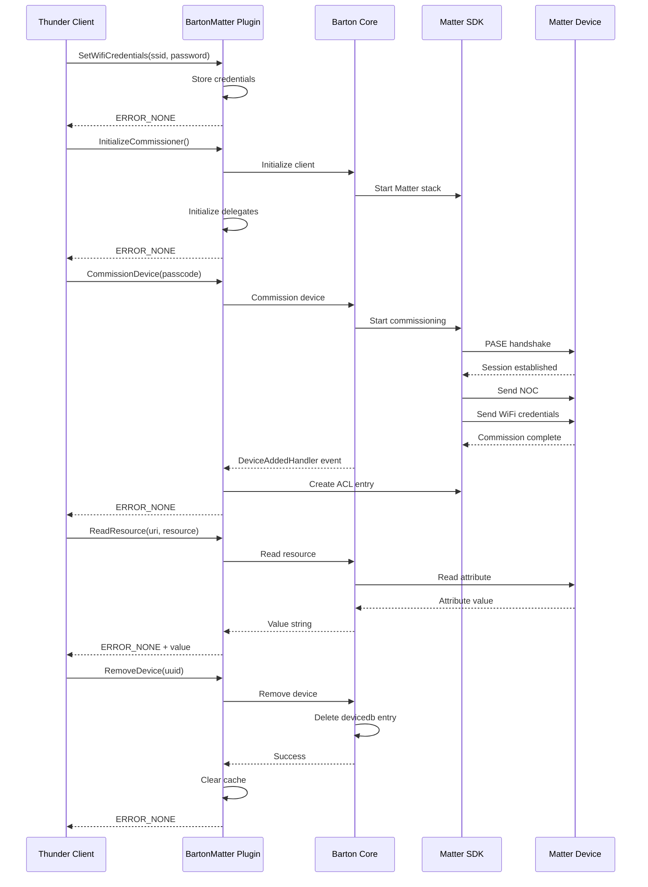

# BartonMatter Public API Reference

## Overview

This document provides comprehensive documentation for all public APIs exposed by the BartonMatter plugin. These APIs enable external applications to interact with Matter devices, commission new devices, manage WiFi credentials, and control device lifecycle operations.

All public APIs return `Core::hresult` status codes and follow Thunder framework conventions with `@in` (input) and `@out` (output) parameter annotations.

---

## Table of Contents

1. [Layman's Explanation](#laymans-explanation)
2. [API Categories](#api-categories)
3. [Return Codes](#return-codes)
4. [API Reference](#api-reference)
   - [SetWifiCredentials](#setwificredentials)
   - [InitializeCommissioner](#initializecommissioner)
   - [CommissionDevice](#commissiondevice)
   - [ReadResource](#readresource)
   - [WriteResource](#writeresource)
   - [ListDevices](#listdevices)
   - [GetCommissionedDeviceInfo](#getcommissioneddeviceinfo)
   - [RemoveDevice](#removedevice)
   - [OpenCommissioningWindow](#opencommissioningwindow)
5. [Usage Examples](#usage-examples)
6. [Flow Diagrams](#flow-diagrams)
7. [Error Handling](#error-handling)
8. [Best Practices](#best-practices)
9. [Troubleshooting](#troubleshooting)

---

## Layman's Explanation

### What Are These APIs?

Think of these APIs as **remote control buttons** for managing your TV's Matter connectivity. Each API is a different button:

- **SetWifiCredentials**: Set the WiFi network info (like programming your WiFi password)
- **InitializeCommissioner**: Turn on the Matter system (like powering on a device)
- **CommissionDevice**: Connect a new device to your TV (like pairing a Bluetooth device)
- **ReadResource**: Check device status (like reading a temperature sensor)
- **WriteResource**: Change device settings (like turning on a light switch)
- **ListDevices**: See all connected devices (like checking paired Bluetooth devices)
- **GetCommissionedDeviceInfo**: Get detailed info about connected devices
- **RemoveDevice**: Disconnect a device (like unpairing Bluetooth)
- **OpenCommissioningWindow**: Let others connect to your TV (like enabling pairing mode)

### Real-World Analogy

```
Your Application (Thunder Client)
       ↓
   [Press API Button]
       ↓
BartonMatter Plugin
       ↓
   [Performs Action]
       ↓
Matter Device / Network
       ↓
   [Action Complete]
       ↓
   [Returns Success/Failure]
```

It's like using a hotel concierge:
- **You (Thunder client)**: Request a service
- **APIs**: Different service desks (WiFi desk, device desk, etc.)
- **BartonMatter**: The concierge who handles your request
- **Result**: Confirmation that your request was completed

---

## API Categories

### Network Configuration
APIs for managing WiFi credentials needed for device commissioning:
- `SetWifiCredentials` - Configure network credentials

### System Initialization
APIs for starting the Matter subsystem:
- `InitializeCommissioner` - Initialize Matter commissioner functionality

### Device Commissioning
APIs for adding devices to the Matter network:
- `CommissionDevice` - Commission a device using setup code
- `OpenCommissioningWindow` - Allow this device to be commissioned

### Device Management
APIs for managing commissioned devices:
- `ListDevices` - Get list of all connected devices
- `GetCommissionedDeviceInfo` - Get detailed device information
- `RemoveDevice` - Unpair and remove a device

### Resource Operations
APIs for reading/writing device attributes:
- `ReadResource` - Read device attributes
- `WriteResource` - Write device attributes

---

## Return Codes

All APIs return `Core::hresult` status codes:

| Return Code | Value | Meaning | When Used |
|------------|-------|---------|-----------|
| `Core::ERROR_NONE` | 0 | Success | Operation completed successfully |
| `Core::ERROR_GENERAL` | 1 | General failure | Unspecified error occurred |
| `Core::ERROR_UNAVAILABLE` | 2 | Service unavailable | Barton client not initialized or no devices |
| `Core::ERROR_INVALID_INPUT_LENGTH` | 5 | Invalid parameter length | Empty string when value required |

**Note**: Check Thunder framework documentation for complete error code list.

---

## API Reference

### SetWifiCredentials

#### Purpose
Configures WiFi network credentials that will be shared with commissioned devices during the commissioning process. These credentials allow the device to join your local network.

#### Signature
```cpp
virtual Core::hresult SetWifiCredentials(
    const std::string ssid,      /* @in */
    const std::string password   /* @in */
) override;
```

#### Parameters

| Name | Direction | Type | Description | Constraints |
|------|-----------|------|-------------|-------------|
| `ssid` | in | `std::string` | WiFi network SSID (name) | Cannot be empty |
| `password` | in | `std::string` | WiFi network password | Cannot be empty |

#### Return Values

| Code | Condition |
|------|-----------|
| `Core::ERROR_NONE` | WiFi credentials successfully stored |
| `Core::ERROR_INVALID_INPUT_LENGTH` | SSID or password is empty |

#### Description

When you commission a Matter device, it needs to join your WiFi network. This API stores the network credentials in memory, and they are automatically provided to devices during commissioning via the NetworkCredentialsProvider interface.

**Thread Safety**: Uses mutex protection (`networkCredsMtx`) for thread-safe credential storage.

**Persistence**: Credentials are stored in memory only and do not persist across plugin restarts.

#### Implementation Details

```cpp
Core::hresult SetWifiCredentials(const std::string ssid, const std::string password)
{
    // 1. Validate inputs
    if (ssid.empty()) {
        return Core::ERROR_INVALID_INPUT_LENGTH;
    }
    if (password.empty()) {
        return Core::ERROR_INVALID_INPUT_LENGTH;
    }

    // 2. Store credentials in global provider (thread-safe)
    b_reference_network_credentials_provider_set_wifi_network_credentials(
        ssid.c_str(),
        password.c_str()
    );

    return Core::ERROR_NONE;
}
```

#### Example Usage

**JSON-RPC Request:**
```json
{
    "jsonrpc": "2.0",
    "id": 1,
    "method": "BartonMatter.1.SetWifiCredentials",
    "params": {
        "ssid": "MyHomeNetwork",
        "password": "SecurePassword123"
    }
}
```

**JSON-RPC Response:**
```json
{
    "jsonrpc": "2.0",
    "id": 1,
    "result": 0
}
```

#### Use Cases

1. **Initial Setup**: Configure WiFi before commissioning first device
2. **Network Change**: Update credentials when changing WiFi networks
3. **Multi-Network**: Set credentials before commissioning devices on different networks

#### Notes

- **Call this before `CommissionDevice()`** - Devices need network access during commissioning
- **Credentials shared with all devices** - All commissioned devices receive the same WiFi credentials
- **No validation** - API does not verify if credentials are correct (verification happens during actual device commissioning)
- **Security**: Credentials stored in plain text in memory (consider encryption for production)

---

### InitializeCommissioner

#### Purpose
Initializes the Matter commissioner subsystem, starts the Barton Core client, and prepares the plugin to commission devices and handle incoming commands.

#### Signature
```cpp
virtual Core::hresult InitializeCommissioner() override;
```

#### Parameters
None.

#### Return Values

| Code | Condition |
|------|-----------|
| `Core::ERROR_NONE` | Commissioner initialized successfully |
| `Core::ERROR_GENERAL` | Failed to initialize Barton client or start commissioning |

#### Description

This is the **first API you must call** after plugin activation. It:
1. Creates the Barton Core client instance
2. Configures Matter device parameters (vendor ID, product ID, etc.)
3. Registers event handlers for device lifecycle events
4. Starts the Matter stack
5. Initializes cluster delegates (KeypadInput, ApplicationLauncher, etc.)
6. Initializes NetworkCommissioning WiFi driver

**Must be called before any other APIs** (except `SetWifiCredentials`).

#### Implementation Details

```cpp
Core::hresult InitializeCommissioner()
{
    // 1. Set default WiFi credentials if none provided
    if (!network_ssid && !network_psk) {
        b_reference_network_credentials_provider_set_wifi_network_credentials(
            "MySSID", "MyPassword"
        );
    }

    // 2. Initialize Barton client with storage paths
    gchar* confDir = GetConfigDirectory();  // "/opt/.brtn-ds"
    InitializeClient(confDir);

    // 3. Verify client created
    if (!bartonClient) {
        return Core::ERROR_GENERAL;
    }

    // 4. Start the Matter stack
    if (!b_core_client_start(bartonClient)) {
        return Core::ERROR_GENERAL;
    }

    // 5. Set system properties
    b_core_client_set_system_property(bartonClient, "deviceDescriptorBypass", "true");

    // 6. Initialize cluster delegates on Matter event loop
    chip::DeviceLayer::PlatformMgr().ScheduleWork([](intptr_t) {
        MatterClusterDelegateManager::GetInstance().Initialize();
        MatterClusterDelegateManager::GetInstance().InitializeNetworkCommissioning();
    });

    return Core::ERROR_NONE;
}
```

#### Configuration Details

**Device Information** (set automatically):
- Vendor Name: "Barton"
- Vendor ID: 0xFFF1
- Product Name: "Barton Device"
- Product ID: 0x5678
- Hardware Version: 1
- Serial Number: "SN-123456789"
- Setup Discriminator: 3840 (development default)
- Setup Passcode: 20202021 (development default)

**Storage Paths**:
- Config Directory: `/opt/.brtn-ds`
- Matter Storage: `/opt/.brtn-ds/matter`
- Device Database: `/opt/.brtn-ds/storage/devicedb`

#### Event Handlers Registered

| Event | Handler | Purpose |
|-------|---------|---------|
| `DEVICE_ADDED` | `DeviceAddedHandler` | Creates ACL entries for commissioned devices |
| `DEVICE_REMOVED` | `DeviceRemovedHandler` | Cleans up device cache |
| `ENDPOINT_ADDED` | `EndpointAddedHandler` | Tracks device endpoints |

#### Example Usage

**JSON-RPC Request:**
```json
{
    "jsonrpc": "2.0",
    "id": 2,
    "method": "BartonMatter.1.InitializeCommissioner",
    "params": {}
}
```

**JSON-RPC Response:**
```json
{
    "jsonrpc": "2.0",
    "id": 2,
    "result": 0
}
```

#### Use Cases

1. **Plugin Startup**: First call after Thunder activates the plugin
2. **System Recovery**: Re-initialize after error or crash
3. **Fresh Start**: Initialize clean Matter stack

#### Notes

- **Call once per plugin lifetime** - Multiple calls have no effect (client already exists)
- **Blocks until complete** - May take 2-5 seconds to initialize full Matter stack
- **Requires file system access** - Needs write permissions to `/opt/.brtn-ds`
- **Default credentials used** - If `SetWifiCredentials()` not called, uses defaults

---

### CommissionDevice

#### Purpose
Commission a Matter device using its setup code (QR code or manual pairing code). This adds the device to your Matter network and enables it to communicate with your TV.

#### Signature
```cpp
virtual Core::hresult CommissionDevice(
    const std::string passcode  /* @in */
) override;
```

#### Parameters

| Name | Direction | Type | Description | Constraints |
|------|-----------|------|-------------|-------------|
| `passcode` | in | `std::string` | Matter setup code (QR code payload or manual code) | Cannot be empty |

#### Return Values

| Code | Condition |
|------|-----------|
| `Core::ERROR_NONE` | Commissioning started successfully |
| `Core::ERROR_GENERAL` | Barton client not initialized or commissioning failed |
| `Core::ERROR_INVALID_INPUT_LENGTH` | Passcode is empty |

#### Description

Commissions a Matter device by:
1. Parsing the setup code to extract device info
2. Establishing a secure PASE (Password Authenticated Session Establishment) session
3. Exchanging Node Operational Certificates (NOCs)
4. Adding device to the fabric
5. Sharing WiFi credentials (if device needs network access)
6. Creating ACL entries to allow device access to TV endpoints
7. Triggering `DeviceAddedHandler` event on success

**Timeout**: 120 seconds (hardcoded) for commissioning to complete.

**Asynchronous Operation**: This API initiates commissioning and returns immediately. Success/failure is reported via `DeviceAddedHandler` event.

#### Setup Code Formats

**QR Code Payload:**
```
MT:Y3.V9M-123456789
```

**Manual Pairing Code (11-digit):**
```
34970112332
```

Both formats are accepted and automatically parsed by the Matter SDK.

#### Implementation Details

```cpp
Core::hresult CommissionDevice(const std::string passcode)
{
    // 1. Validate client initialized
    if (!bartonClient) {
        return Core::ERROR_GENERAL;
    }

    // 2. Validate passcode
    if (passcode.empty()) {
        return Core::ERROR_INVALID_INPUT_LENGTH;
    }

    // 3. Start commissioning (async, 120s timeout)
    gchar* setupPayload = g_strdup(passcode.c_str());
    bool result = b_core_client_commission_device(
        bartonClient,
        setupPayload,
        120  // timeout in seconds
    );

    // 4. Return result (commissioning continues async)
    return result ? Core::ERROR_NONE : Core::ERROR_GENERAL;
}
```

#### Commissioning Flow

```
1. Parse Setup Code
   ├─ Extract discriminator
   ├─ Extract setup PIN
   └─ Extract vendor/product info

2. Device Discovery
   ├─ mDNS discovery using discriminator
   └─ Connect to device

3. PASE Session
   ├─ Establish secure session using PIN
   └─ Verify device identity

4. Operational Certificate Exchange
   ├─ Generate NOC for device
   ├─ Install NOC on device
   └─ Add device to fabric

5. Network Provisioning
   ├─ Read NetworkCommissioning cluster
   ├─ Send WiFi credentials (if needed)
   └─ Device connects to network

6. Post-Commission Setup
   ├─ Fire DeviceAddedHandler event
   ├─ Create ACL entries
   ├─ Establish CASE session
   └─ Write binding information
```

#### Example Usage

**JSON-RPC Request (QR Code):**
```json
{
    "jsonrpc": "2.0",
    "id": 3,
    "method": "BartonMatter.1.CommissionDevice",
    "params": {
        "passcode": "MT:Y3.V9M-123456789"
    }
}
```

**JSON-RPC Request (Manual Code):**
```json
{
    "jsonrpc": "2.0",
    "id": 3,
    "method": "BartonMatter.1.CommissionDevice",
    "params": {
        "passcode": "34970112332"
    }
}
```

**JSON-RPC Response:**
```json
{
    "jsonrpc": "2.0",
    "id": 3,
    "result": 0
}
```

#### Use Cases

1. **tv-casting-app Commissioning**: User scans QR code on TV with mobile app
2. **Voice Assistant Pairing**: User provides pairing code to Alexa
3. **Automated Testing**: Scripts commission test devices

#### Notes

- **Requires WiFi credentials** - Call `SetWifiCredentials()` first for WiFi devices
- **Asynchronous operation** - Success response means commissioning *started*, not completed
- **Monitor events** - Watch for `DeviceAddedHandler` event to know when commissioning completes
- **One device at a time** - Wait for previous commissioning to complete before starting new one
- **ACL auto-created** - ACL entries automatically created on successful commissioning
- **Timeout handling** - Commissioning auto-fails after 120 seconds

---

### ReadResource

#### Purpose
Read an attribute value from a commissioned device's endpoint using Barton Core's resource URI system.

#### Signature
```cpp
virtual Core::hresult ReadResource(
    std::string uri,            /* @in */
    std::string resourceType,   /* @in */
    std::string& result         /* @out */
) override;
```

#### Parameters

| Name | Direction | Type | Description |
|------|-----------|------|-------------|
| `uri` | in | `std::string` | Device URI (e.g., device's UUID) |
| `resourceType` | in | `std::string` | Resource identifier (cluster.attribute format) |
| `result` | out | `std::string` | Attribute value as string |

#### Return Values

| Code | Condition |
|------|-----------|
| `Core::ERROR_NONE` | Attribute read successfully |
| `Core::ERROR_GENERAL` | Read failed (device offline, invalid resource, etc.) |

#### Description

Reads a Matter cluster attribute from a commissioned device. The API constructs a resource URI in the format:
```
/<deviceUri>/ep/1/r/<resourceType>
```

And uses Barton Core's `b_core_client_read_resource()` to perform the read operation over the Matter network.

#### URI Construction

**Input**:
- `uri` = "90034FD9068DFF14" (device UUID)
- `resourceType` = "onoff.onoff"

**Constructed Full URI**:
```
/90034FD9068DFF14/ep/1/r/onoff.onoff
```

**URI Components**:
- `/` - Root
- `90034FD9068DFF14` - Device identifier
- `/ep/1` - Endpoint 1
- `/r/` - Resource indicator
- `onoff.onoff` - Cluster and attribute

#### Resource Type Format

Format: `<cluster>.<attribute>`

**Examples**:
```
"onoff.onoff"                 # OnOff cluster, OnOff attribute (boolean)
"levelcontrol.currentlevel"   # LevelControl cluster, CurrentLevel attribute (uint8)
"mediaplayback.currentstate"  # MediaPlayback cluster, CurrentState attribute (enum)
```

#### Implementation Details

```cpp
Core::hresult ReadResource(
    std::string uri,
    std::string resourceType,
    std::string& result)
{
    // 1. Construct full URI
    std::string fullUri = "/" + uri + "/ep/1/r/" + resourceType;

    // 2. Perform read via Barton Core
    GError* err = NULL;
    gchar* value = b_core_client_read_resource(bartonClient, fullUri.c_str(), &err);

    // 3. Check result
    if (err == NULL && value != NULL) {
        result = std::string(value);
        return Core::ERROR_NONE;
    } else {
        result = "";
        return Core::ERROR_GENERAL;
    }
}
```

#### Example Usage

**Read OnOff State:**
```json
{
    "jsonrpc": "2.0",
    "id": 4,
    "method": "BartonMatter.1.ReadResource",
    "params": {
        "uri": "90034FD9068DFF14",
        "resourceType": "onoff.onoff",
        "result": ""
    }
}
```

**Response:**
```json
{
    "jsonrpc": "2.0",
    "id": 4,
    "result": {
        "result": "true"
    }
}
```

**Read Media Playback State:**
```json
{
    "jsonrpc": "2.0",
    "id": 5,
    "method": "BartonMatter.1.ReadResource",
    "params": {
        "uri": "90034FD9068DFF14",
        "resourceType": "mediaplayback.currentstate"
    }
}
```

**Response:**
```json
{
    "jsonrpc": "2.0",
    "id": 5,
    "result": {
        "result": "1"
    }
}
```

#### Use Cases

1. **Device Status Check**: Read current state before sending command
2. **Monitoring**: Poll device attributes periodically
3. **UI Updates**: Display current device state in UI

#### Notes

- **Endpoint hardcoded to 1** - Current implementation only reads from endpoint 1
- **String response** - All values returned as strings (booleans as "true"/"false", numbers as digits)
- **Type conversion required** - Application must parse string to appropriate type
- **Synchronous operation** - Blocks until read completes or times out
- **Device must be online** - Returns error if device unreachable

---

### WriteResource

#### Purpose
Write an attribute value to a commissioned device's endpoint using Barton Core's resource URI system.

#### Signature
```cpp
virtual Core::hresult WriteResource(
    std::string uri,            /* @in */
    std::string resourceType,   /* @in */
    std::string value           /* @in */
) override;
```

#### Parameters

| Name | Direction | Type | Description |
|------|-----------|------|-------------|
| `uri` | in | `std::string` | Device URI (e.g., device's UUID) |
| `resourceType` | in | `std::string` | Resource identifier (cluster.attribute format) |
| `value` | in | `std::string` | New attribute value as string |

#### Return Values

| Code | Condition |
|------|-----------|
| `Core::ERROR_NONE` | Attribute written successfully |
| `Core::ERROR_GENERAL` | Write failed (device offline, read-only attribute, etc.) |

#### Description

Writes a Matter cluster attribute to a commissioned device. Similar to `ReadResource`, it constructs a URI and uses Barton Core's `b_core_client_write_resource()` to perform the write.

**URI Format**: Same as `ReadResource` - `/<uri>/ep/1/r/<resourceType>`

#### Value Format

Values must be provided as strings in formats that Barton Core can parse:

| Type | Example Value |
|------|---------------|
| Boolean | `"true"` or `"false"` |
| Integer | `"42"`, `"100"` |
| String | `"hello"` |
| Enum | `"1"` (numeric enum value) |

#### Implementation Details

```cpp
Core::hresult WriteResource(
    std::string uri,
    std::string resourceType,
    std::string value)
{
    // 1. Construct full URI
    std::string fullUri = "/" + uri + "/ep/1/r/" + resourceType;

    // 2. Perform write via Barton Core
    GError* err = NULL;
    bool success = b_core_client_write_resource(
        bartonClient,
        fullUri.c_str(),
        value.c_str()
    );

    // 3. Return result
    return success ? Core::ERROR_NONE : Core::ERROR_GENERAL;
}
```

#### Example Usage

**Turn Device On:**
```json
{
    "jsonrpc": "2.0",
    "id": 6,
    "method": "BartonMatter.1.WriteResource",
    "params": {
        "uri": "90034FD9068DFF14",
        "resourceType": "onoff.onoff",
        "value": "true"
    }
}
```

**Set Brightness Level:**
```json
{
    "jsonrpc": "2.0",
    "id": 7,
    "method": "BartonMatter.1.WriteResource",
    "params": {
        "uri": "90034FD9068DFF14",
        "resourceType": "levelcontrol.currentlevel",
        "value": "128"
    }
}
```

**Response (Success):**
```json
{
    "jsonrpc": "2.0",
    "id": 6,
    "result": 0
}
```

#### Use Cases

1. **Device Control**: Turn devices on/off, adjust levels
2. **Configuration**: Set device settings remotely
3. **Automation**: Trigger actions based on conditions

#### Notes

- **Not for commands** - Use cluster commands (via delegates) for operations like LaunchApp
- **Attribute writes only** - Only works for writable attributes
- **Type conversion** - Value string must match expected attribute type
- **ACL enforcement** - Device checks ACL before accepting write
- **Synchronous** - Blocks until write completes

---

### ListDevices

#### Purpose
Retrieve a JSON array of all commissioned Matter devices currently paired with the TV.

#### Signature
```cpp
virtual Core::hresult ListDevices(
    std::string& deviceList  /* @out */
) override;
```

#### Parameters

| Name | Direction | Type | Description |
|------|-----------|------|-------------|
| `deviceList` | out | `std::string` | JSON array of device UUIDs |

#### Return Values

| Code | Condition |
|------|-----------|
| `Core::ERROR_NONE` | Device list retrieved successfully |
| `Core::ERROR_UNAVAILABLE` | No devices found or Barton client not initialized |

#### Description

Returns a JSON array containing the UUIDs of all devices currently commissioned to the TV. The list is obtained by querying Barton Core's internal device registry.

#### Output Format

**JSON Structure:**
```json
["<deviceUuid1>", "<deviceUuid2>", ...]
```

**Example:**
```json
["90034FD9068DFF14", "A1B2C3D4E5F67890"]
```

**Empty Result:**
```json
[]
```

#### Implementation Details

```cpp
Core::hresult ListDevices(std::string& deviceList)
{
    // 1. Check client initialized
    if (!bartonClient) {
        deviceList = "[]";
        return Core::ERROR_UNAVAILABLE;
    }

    // 2. Get device list from Barton Core
    g_autolist(BCoreDevice) devices = b_core_client_get_devices(bartonClient);

    // 3. Extract UUIDs
    std::vector<std::string> deviceUuids;
    for (GList* iter = devices; iter != NULL; iter = iter->next) {
        BCoreDevice* device = B_CORE_DEVICE(iter->data);
        gchar* uuid = NULL;
        g_object_get(device, "uuid", &uuid, NULL);

        if (uuid) {
            deviceUuids.push_back(std::string(uuid));
            g_free(uuid);
        }
    }

    // 4. Check if any devices found
    if (deviceUuids.empty()) {
        deviceList = "[]";
        return Core::ERROR_UNAVAILABLE;
    }

    // 5. Build JSON array
    deviceList = "[";
    for (size_t i = 0; i < deviceUuids.size(); ++i) {
        deviceList += "\"" + deviceUuids[i] + "\"";
        if (i < deviceUuids.size() - 1) {
            deviceList += ",";
        }
    }
    deviceList += "]";

    return Core::ERROR_NONE;
}
```

#### Example Usage

**JSON-RPC Request:**
```json
{
    "jsonrpc": "2.0",
    "id": 8,
    "method": "BartonMatter.1.ListDevices",
    "params": {}
}
```

**JSON-RPC Response (2 devices):**
```json
{
    "jsonrpc": "2.0",
    "id": 8,
    "result": {
        "deviceList": "[\"90034FD9068DFF14\",\"A1B2C3D4E5F67890\"]"
    }
}
```

**JSON-RPC Response (no devices):**
```json
{
    "jsonrpc": "2.0",
    "id": 8,
    "result": {
        "deviceList": "[]"
    }
}
```

#### Use Cases

1. **Device Discovery**: List all paired devices in UI
2. **Device Selection**: Let user choose device for operation
3. **Status Dashboard**: Display connected device count

#### Notes

- **Runtime query** - Queries current in-memory device list (not filesystem)
- **Active devices only** - Only returns devices currently in Barton Core registry
- **UUID only** - Returns device identifiers, not full device info (use `GetCommissionedDeviceInfo` for details)
- **Order not guaranteed** - Device order may vary between calls

---

### GetCommissionedDeviceInfo

#### Purpose
Retrieve detailed information about all commissioned devices, including their NodeId and model name, by scanning the device database on disk.

#### Signature
```cpp
virtual Core::hresult GetCommissionedDeviceInfo(
    std::string& deviceInfo  /* @out */
) override;
```

#### Parameters

| Name | Direction | Type | Description |
|------|-----------|------|-------------|
| `deviceInfo` | out | `std::string` | JSON array of device objects with nodeId and model |

#### Return Values

| Code | Condition |
|------|-----------|
| `Core::ERROR_NONE` | Device info retrieved successfully |
| `Core::ERROR_UNAVAILABLE` | No commissioned devices found |

#### Description

Scans the persistent device database (`/opt/.brtn-ds/storage/devicedb`) on first call to build a cache of commissioned devices. Returns JSON array with NodeId and model information for each device.

**Caching**: First call scans filesystem and caches results. Subsequent calls return cached data unless cache is invalidated (e.g., by `RemoveDevice()`).

#### Output Format

**JSON Structure:**
```json
[
    {
        "nodeId": "<hexNodeId>",
        "model": "<modelName>"
    },
    ...
]
```

**Example:**
```json
[
    {
        "nodeId": "90034FD9068DFF14",
        "model": "tv-casting-app"
    },
    {
        "nodeId": "A1B2C3D4E5F67890",
        "model": "SpeakerDevice"
    }
]
```

**Empty Result:**
```json
[]
```

#### Implementation Details

```cpp
Core::hresult GetCommissionedDeviceInfo(std::string& deviceInfo)
{
    std::lock_guard<std::mutex> lock(devicesCacheMtx);

    // 1. Scan devicedb on first call
    if (!devicesCacheInitialized) {
        ScanDeviceDatabase();  // Scans /opt/.brtn-ds/storage/devicedb
        devicesCacheInitialized = true;
    }

    // 2. Check if devices found
    if (commissionedDevicesCache.empty()) {
        deviceInfo = "[]";
        return Core::ERROR_UNAVAILABLE;
    }

    // 3. Build JSON array
    deviceInfo = "[";
    bool first = true;

    for (const auto& device : commissionedDevicesCache) {
        if (!first) deviceInfo += ",";
        first = false;

        deviceInfo += "{";
        deviceInfo += "\"nodeId\":\"" + device.first + "\"";
        deviceInfo += ",\"model\":\"" + device.second + "\"";
        deviceInfo += "}";
    }

    deviceInfo += "]";

    return Core::ERROR_NONE;
}
```

#### Device Database Scanning

The API scans `/opt/.brtn-ds/storage/devicedb` which contains:
```
devicedb/
├── 90034FD9068DFF14/
│   └── device.db (contains model info)
├── A1B2C3D4E5F67890/
│   └── device.db
└── ...
```

Each directory name is the device's NodeId (hex string).

#### Example Usage

**JSON-RPC Request:**
```json
{
    "jsonrpc": "2.0",
    "id": 9,
    "method": "BartonMatter.1.GetCommissionedDeviceInfo",
    "params": {}
}
```

**JSON-RPC Response:**
```json
{
    "jsonrpc": "2.0",
    "id": 9,
    "result": {
        "deviceInfo": "[{\"nodeId\":\"90034FD9068DFF14\",\"model\":\"tv-casting-app\"},{\"nodeId\":\"A1B2C3D4E5F67890\",\"model\":\"SpeakerDevice\"}]"
    }
}
```

#### Use Cases

1. **Device Inventory**: Display list of all ever-commissioned devices
2. **Reconnection**: Show devices that can be reconnected
3. **Management UI**: Full device list with model names

#### Notes

- **Persistent scan** - Scans filesystem, finds devices even if offline
- **Caching** - First call slower (filesystem scan), subsequent calls fast (memory)
- **Cache invalidation** - `RemoveDevice()` clears cache to force rescan
- **Model name source** - Initially uses device class, updated from devicedb later
- **Thread-safe** - Uses mutex for cache access

---

### RemoveDevice

#### Purpose
Unpair and permanently remove a commissioned device from the Matter network by deleting its database entry and all associated data.

#### Signature
```cpp
virtual Core::hresult RemoveDevice(
    const std::string deviceUuid  /* @in */
) override;
```

#### Parameters

| Name | Direction | Type | Description | Constraints |
|------|-----------|------|-------------|-------------|
| `deviceUuid` | in | `std::string` | Device UUID to remove | Cannot be empty |

#### Return Values

| Code | Condition |
|------|-----------|
| `Core::ERROR_NONE` | Device removed successfully |
| `Core::ERROR_GENERAL` | Removal failed (device not found, I/O error) |
| `Core::ERROR_UNAVAILABLE` | Barton client not initialized |
| `Core::ERROR_INVALID_INPUT_LENGTH` | Device UUID is empty |

#### Description

Permanently removes a commissioned device by:
1. Deleting the device's database directory (`/opt/.brtn-ds/storage/devicedb/<uuid>/`)
2. Removing all associated commissioning data
3. Clearing the device from internal caches
4. Invalidating the commissioned devices cache

**Warning**: This operation is **irreversible**. The device must be re-commissioned to use it again.

#### Implementation Details

```cpp
Core::hresult RemoveDevice(const std::string deviceUuid)
{
    // 1. Validate client
    if (!bartonClient) {
        return Core::ERROR_UNAVAILABLE;
    }

    // 2. Validate UUID
    if (deviceUuid.empty()) {
        return Core::ERROR_INVALID_INPUT_LENGTH;
    }

    // 3. Remove device via Barton Core
    gboolean result = b_core_client_remove_device(bartonClient, deviceUuid.c_str());

    if (result) {
        // 4. Clear cache and force rescan
        std::lock_guard<std::mutex> lock(devicesCacheMtx);
        commissionedDevicesCache.clear();
        devicesCacheInitialized = false;

        return Core::ERROR_NONE;
    } else {
        return Core::ERROR_GENERAL;
    }
}
```

#### What Gets Deleted

- `/opt/.brtn-ds/storage/devicedb/<uuid>/` - Entire device directory
  - `device.db` - Device metadata
  - NOC (Node Operational Certificate)
  - Session keys
  - Binding information

#### Example Usage

**JSON-RPC Request:**
```json
{
    "jsonrpc": "2.0",
    "id": 10,
    "method": "BartonMatter.1.RemoveDevice",
    "params": {
        "deviceUuid": "90034FD9068DFF14"
    }
}
```

**JSON-RPC Response (Success):**
```json
{
    "jsonrpc": "2.0",
    "id": 10,
    "result": 0
}
```

**JSON-RPC Response (Not Found):**
```json
{
    "jsonrpc": "2.0",
    "id": 10,
    "result": 1
}
```

#### Use Cases

1. **Device Unpairing**: User wants to disconnect device
2. **Factory Reset**: Clear all devices before reset
3. **Troubleshooting**: Remove problematic device and re-commission

#### Notes

- **Permanent deletion** - Cannot be undone
- **Re-commission required** - Device must go through full commissioning again
- **ACL not removed** - ACL entries remain (harmless, will be overwritten if device re-commissioned)
- **Cache invalidated** - Forces `GetCommissionedDeviceInfo()` to rescan filesystem
- **Event triggered** - Triggers `DeviceRemovedHandler` event

---

### OpenCommissioningWindow

#### Purpose
Open a commissioning window on this TV device to allow external controllers (like smart speakers or mobile apps) to commission it and control it.

#### Signature
```cpp
virtual Core::hresult OpenCommissioningWindow(
    const uint16_t timeoutSeconds,    /* @in */
    std::string& commissioningInfo    /* @out */
) override;
```

#### Parameters

| Name | Direction | Type | Description | Constraints |
|------|-----------|------|-------------|-------------|
| `timeoutSeconds` | in | `uint16_t` | How long to keep window open (0 = default) | 0-65535 |
| `commissioningInfo` | out | `std::string` | JSON with manualCode and qrCode | - |

#### Return Values

| Code | Condition |
|------|-----------|
| `Core::ERROR_NONE` | Commissioning window opened, codes returned |
| `Core::ERROR_UNAVAILABLE` | Barton client not initialized |
| `Core::ERROR_GENERAL` | Failed to open window or retrieve codes |

#### Description

Opens a commissioning window on the local TV device, allowing external Matter controllers to commission it. Returns both the 11-digit manual pairing code and QR code payload that controllers can use.

**Use Case**: When your TV acts as a **commissionee** (being controlled) rather than commissioner (controlling others).

#### Output Format

**JSON Structure:**
```json
{
    "manualCode": "<11-digit-code>",
    "qrCode": "<QR-payload>"
}
```

**Example:**
```json
{
    "manualCode": "34970112332",
    "qrCode": "MT:Y3.V9M-123456789"
}
```

#### Implementation Details

```cpp
Core::hresult OpenCommissioningWindow(
    const uint16_t timeoutSeconds,
    std::string& commissioningInfo)
{
    // 1. Validate client
    if (!bartonClient) {
        commissioningInfo = "{}";
        return Core::ERROR_UNAVAILABLE;
    }

    // 2. Open commissioning window (device ID "0" = local device)
    BCoreCommissioningInfo* info = b_core_client_open_commissioning_window(
        bartonClient,
        "0",  // Local device
        timeoutSeconds
    );

    if (!info) {
        commissioningInfo = "{}";
        return Core::ERROR_GENERAL;
    }

    // 3. Extract codes
    gchar* manualCode = NULL;
    gchar* qrCode = NULL;
    g_object_get(info, "manual-code", &manualCode, "qr-code", &qrCode, NULL);

    if (!manualCode || !qrCode) {
        commissioningInfo = "{}";
        return Core::ERROR_GENERAL;
    }

    // 4. Build JSON response
    commissioningInfo = "{";
    commissioningInfo += "\"manualCode\":\"" + std::string(manualCode) + "\"";
    commissioningInfo += ",\"qrCode\":\"" + std::string(qrCode) + "\"";
    commissioningInfo += "}";

    return Core::ERROR_NONE;
}
```

#### Commissioning Window Lifecycle

```
1. Window Opened
   ├─ Generate random passcode
   ├─ Create manual pairing code (11 digits)
   ├─ Create QR code payload
   └─ Start mDNS advertising

2. Window Active (timeout period)
   ├─ Device advertises commissioning service
   ├─ Controllers can discover and pair
   └─ Accepts PASE connections

3. Window Closed (timeout or successful commission)
   ├─ Stop mDNS advertising
   ├─ Reject new PASE attempts
   └─ Cleanup temporary keys
```

#### Example Usage

**JSON-RPC Request (5 minute window):**
```json
{
    "jsonrpc": "2.0",
    "id": 11,
    "method": "BartonMatter.1.OpenCommissioningWindow",
    "params": {
        "timeoutSeconds": 300
    }
}
```

**JSON-RPC Response:**
```json
{
    "jsonrpc": "2.0",
    "id": 11,
    "result": {
        "commissioningInfo": "{\"manualCode\":\"34970112332\",\"qrCode\":\"MT:Y3.V9M-123456789\"}"
    }
}
```

#### Use Cases

1. **Smart Speaker Setup**: "Alexa, discover devices" → TV opens window → Alexa commissions TV
2. **Mobile App Control**: User adds TV to mobile app → App scans QR code → TV commissioned
3. **Multi-Controller**: Multiple controllers (Alexa + Google Home) control same TV

#### Notes

- **Role reversal** - TV becomes commissionee instead of commissioner
- **Security** - Commissioning window has limited timeout for security
- **One-time codes** - Manual/QR codes change each time window opened
- **Default timeout** - Passing 0 uses Matter SDK default (typically 3 minutes)
- **Display codes** - Show QR code and manual code in TV UI for user to scan/enter

---

## Usage Examples

### Complete Commissioning Flow

```javascript
// 1. Set WiFi credentials
let response = await thunderClient.call("BartonMatter.1.SetWifiCredentials", {
    ssid: "MyHomeNetwork",
    password: "SecurePassword123"
});

// 2. Initialize commissioner
response = await thunderClient.call("BartonMatter.1.InitializeCommissioner", {});

// 3. Commission a device (user provides QR code)
response = await thunderClient.call("BartonMatter.1.CommissionDevice", {
    passcode: "MT:Y3.V9M-123456789"
});

// 4. Wait for DeviceAddedHandler event (async)
// ... commissioning happens in background ...

// 5. List commissioned devices
response = await thunderClient.call("BartonMatter.1.ListDevices", {});
console.log("Devices:", response.deviceList);

// 6. Get detailed device info
response = await thunderClient.call("BartonMatter.1.GetCommissionedDeviceInfo", {});
console.log("Device Info:", response.deviceInfo);
```

### Device Control Flow

```javascript
// Read device state
let response = await thunderClient.call("BartonMatter.1.ReadResource", {
    uri: "90034FD9068DFF14",
    resourceType: "onoff.onoff"
});
console.log("Device is:", response.result === "true" ? "ON" : "OFF");

// Turn device on
response = await thunderClient.call("BartonMatter.1.WriteResource", {
    uri: "90034FD9068DFF14",
    resourceType: "onoff.onoff",
    value: "true"
});
```

### TV as Commissionee Flow

```javascript
// Open commissioning window for 5 minutes
let response = await thunderClient.call("BartonMatter.1.OpenCommissioningWindow", {
    timeoutSeconds: 300
});

let info = JSON.parse(response.commissioningInfo);
console.log("Manual Code:", info.manualCode);
console.log("QR Code:", info.qrCode);

// Display QR code on TV screen for user to scan
displayQRCode(info.qrCode);

// Or show manual code for voice input
displayManualCode(info.manualCode);
```

---

## Flow Diagrams

### API Call Sequence Diagram



### State Machine

```
┌─────────────┐
│ Plugin      │
│ Inactive    │
└──────┬──────┘
       │ SetWifiCredentials (optional)
       ↓
┌─────────────┐
│ Credentials │
│ Set         │
└──────┬──────┘
       │ InitializeCommissioner
       ↓
┌─────────────┐
│ Commissioner│
│ Ready       │←────────────────────────┐
└──────┬──────┘                         │
       │ CommissionDevice               │
       ↓                                │
┌─────────────┐                         │
│Commissioning│                         │
│ In Progress │                         │
└──────┬──────┘                         │
       │ (async)                        │
       ↓                                │
┌─────────────┐                         │
│ Device      │                         │
│ Commissioned│─────────────────────────┤
└──────┬──────┘                         │
       │                                │
       ├─ ReadResource ─────────────────┤
       ├─ WriteResource ────────────────┤
       ├─ ListDevices ─────────────────┤
       ├─ GetCommissionedDeviceInfo ───┤
       └─ RemoveDevice                  │
          └───────────────────────────>─┘
```

---

## Error Handling

### Common Error Patterns

#### ERROR_UNAVAILABLE
**Meaning**: Service or resource not available

**Common Causes**:
- Barton client not initialized (forgot to call `InitializeCommissioner`)
- No devices commissioned (empty device list)
- Matter stack not started

**Recovery**:
```javascript
try {
    await thunderClient.call("BartonMatter.1.ListDevices", {});
} catch (error) {
    if (error.code === 2) {  // ERROR_UNAVAILABLE
        // Initialize first
        await thunderClient.call("BartonMatter.1.InitializeCommissioner", {});
        // Retry
        await thunderClient.call("BartonMatter.1.ListDevices", {});
    }
}
```

#### ERROR_INVALID_INPUT_LENGTH
**Meaning**: Required parameter is empty

**Common Causes**:
- Empty SSID or password in `SetWifiCredentials`
- Empty passcode in `CommissionDevice`
- Empty UUID in `RemoveDevice`

**Prevention**:
```javascript
function validateInputs(ssid, password) {
    if (!ssid || ssid.trim() === "") {
        throw new Error("SSID cannot be empty");
    }
    if (!password || password.trim() === "") {
        throw new Error("Password cannot be empty");
    }
}
```

#### ERROR_GENERAL
**Meaning**: Operation failed

**Common Causes**:
- Device offline during `ReadResource`/`WriteResource`
- Invalid QR code in `CommissionDevice`
- Commissioning timeout
- Device not found in `RemoveDevice`

**Debugging**:
```bash
# Check Thunder logs
journalctl -u wpeframework -f | grep BartonMatter

# Check Matter SDK logs
journalctl -u wpeframework -f | grep "AppServer\|ChipTool"
```

### Retry Strategies

**Transient Errors** (network issues, timeout):
```javascript
async function retryOperation(operation, maxRetries = 3, delayMs = 1000) {
    for (let attempt = 1; attempt <= maxRetries; attempt++) {
        try {
            return await operation();
        } catch (error) {
            if (attempt === maxRetries) throw error;
            console.log(`Attempt ${attempt} failed, retrying in ${delayMs}ms...`);
            await sleep(delayMs);
            delayMs *= 2;  // Exponential backoff
        }
    }
}

// Usage
await retryOperation(() =>
    thunderClient.call("BartonMatter.1.ReadResource", params)
);
```

**Permanent Errors** (invalid input):
```javascript
// Don't retry, fix input instead
if (error.code === Core.ERROR_INVALID_INPUT_LENGTH) {
    console.error("Invalid input, please correct and try again");
    return;
}
```

---

## Best Practices

### 1. API Call Sequencing

**Correct Order**:
```javascript
// 1. Set credentials (before commissioning)
await setWifiCredentials();

// 2. Initialize (once per plugin lifetime)
await initializeCommissioner();

// 3. Commission devices (as needed)
await commissionDevice(qrCode);

// 4. Operate on devices
await readResource();
await writeResource();
```

**Common Mistake**:
```javascript
// ❌ WRONG: Commission before initialize
await commissionDevice(qrCode);  // Fails!
await initializeCommissioner();

// ✅ CORRECT:
await initializeCommissioner();
await commissionDevice(qrCode);
```

### 2. Asynchronous Operation Handling

**CommissionDevice is async**:
```javascript
// ❌ WRONG: Assume immediate success
await thunderClient.call("BartonMatter.1.CommissionDevice", params);
let devices = await thunderClient.call("BartonMatter.1.ListDevices", {});
// Device not in list yet! Commissioning still in progress

// ✅ CORRECT: Wait for DeviceAddedHandler event or poll
await thunderClient.call("BartonMatter.1.CommissionDevice", params);
await waitForDeviceAdded(expectedUuid);  // Monitor events
let devices = await thunderClient.call("BartonMatter.1.ListDevices", {});
```

### 3. Resource URI Construction

**Template**:
```javascript
function buildResourceUri(deviceUuid, endpoint, cluster, attribute) {
    return `${deviceUuid}/ep/${endpoint}/r/${cluster}.${attribute}`;
}

// Usage
let uri = buildResourceUri("90034FD9068DFF14", "1", "onoff", "onoff");
// Result: "90034FD9068DFF14" (device URI passed separately)
```

### 4. Error Logging

**Comprehensive Logging**:
```javascript
try {
    let response = await thunderClient.call("BartonMatter.1.ReadResource", {
        uri: deviceUuid,
        resourceType: "onoff.onoff"
    });
    console.log(`[SUCCESS] Read ${resourceType} from ${deviceUuid}: ${response.result}`);
} catch (error) {
    console.error(`[ERROR] Failed to read ${resourceType} from ${deviceUuid}`);
    console.error(`  Code: ${error.code}`);
    console.error(`  Message: ${error.message}`);
    console.error(`  Stack: ${error.stack}`);
}
```

### 5. Cache Management

**GetCommissionedDeviceInfo uses cache**:
```javascript
// First call: Slow (filesystem scan)
let info1 = await getCommissionedDeviceInfo();  // ~500ms

// Subsequent calls: Fast (cached)
let info2 = await getCommissionedDeviceInfo();  // ~5ms

// After RemoveDevice: Cache invalidated, next call rescans
await removeDevice(uuid);
let info3 = await getCommissionedDeviceInfo();  // ~500ms (rescan)
```

### 6. Security Considerations

**Credential Protection**:
```javascript
// ❌ WRONG: Log credentials
console.log(`Setting WiFi: ${ssid}/${password}`);

// ✅ CORRECT: Mask credentials
console.log(`Setting WiFi: ${ssid}/${"*".repeat(password.length)}`);
```

**QR Code Display**:
```javascript
// Display QR code only when needed
let response = await openCommissioningWindow(300);
displayQRCodeModal(response.qrCode);

// Close after timeout or successful commission
setTimeout(() => closeQRCodeModal(), 300000);  // 5 minutes
```

---

## Troubleshooting

### Issue: InitializeCommissioner Fails

**Symptoms**: `ERROR_GENERAL` returned, logs show "Failed to start Barton client"

**Diagnosis**:
```bash
# Check file permissions
ls -la /opt/.brtn-ds/
# Should be writable by Thunder process

# Check disk space
df -h /opt

# Check Matter SDK logs
journalctl -u wpeframework | grep "CHIP\|Matter"
```

**Solutions**:
1. Ensure `/opt/.brtn-ds` exists and is writable
2. Check disk space (need ~10MB for device database)
3. Verify Thunder has file system access (not sandboxed)

---

### Issue: CommissionDevice Times Out

**Symptoms**: Command returns success, but `DeviceAddedHandler` never fires

**Diagnosis**:
```bash
# Check mDNS discovery
dns-sd -B _matterc._udp

# Check network connectivity
ping <device-ip>

# Check commissioning logs
journalctl -u wpeframework | grep "Commission\|PASE"
```

**Solutions**:
1. Verify WiFi credentials set before commissioning
2. Ensure device and TV on same network/subnet
3. Check firewall rules (UDP 5540, TCP 5540)
4. Verify QR code is valid and not expired
5. Try recommissioning (power cycle device first)

---

### Issue: ReadResource/WriteResource Fails

**Symptoms**: `ERROR_GENERAL`, logs show timeout or connection error

**Diagnosis**:
```bash
# Check device is online
# (Device should appear in ListDevices)

# Check ACL entries
matter-cli acl read

# Test with matter-cli
matter-cli interactive start
> onoff read on-off <endpoint>
```

**Solutions**:
1. Verify device commissioned and in device list
2. Check device is powered on and connected to network
3. Verify ACL entries exist for device (created during commissioning)
4. Try re-commissioning device if persistent issues

---

### Issue: OpenCommissioningWindow Returns Empty Codes

**Symptoms**: `ERROR_GENERAL`, commissioningInfo is `{}`

**Diagnosis**:
```bash
# Check if another commissioning window already open
matter-cli descriptor read

# Check Matter logs
journalctl -u wpeframework | grep "Commissioning window"
```

**Solutions**:
1. Close any existing commissioning windows first
2. Wait 30 seconds before opening new window
3. Restart Thunder if window stuck open

---

## Appendix

### Thunder JSON-RPC Call Format

**General Format**:
```json
{
    "jsonrpc": "2.0",
    "id": <request-id>,
    "method": "BartonMatter.1.<APIName>",
    "params": {
        "<param1>": <value1>,
        "<param2>": <value2>
    }
}
```

**Response Format (Success)**:
```json
{
    "jsonrpc": "2.0",
    "id": <request-id>,
    "result": {
        "<output-param>": <value>
    }
}
```

**Response Format (Error)**:
```json
{
    "jsonrpc": "2.0",
    "id": <request-id>,
    "error": {
        "code": <error-code>,
        "message": "<error-message>"
    }
}
```

### Thunder CLI Commands

```bash
# Activate plugin
thunder-send Controller.1.activate '{"callsign":"BartonMatter"}'

# Call API
thunder-send BartonMatter.1.SetWifiCredentials '{"ssid":"MyNet","password":"Pass123"}'

# Check plugin status
thunder-send Controller.1.status '{"callsign":"BartonMatter"}'

# Deactivate plugin
thunder-send Controller.1.deactivate '{"callsign":"BartonMatter"}'
```

### Interface Definition Location

The plugin implements the `Exchange::IBartonMatter` interface defined in:
```
interfaces/IBartonMatter.h
```

### File Paths Reference

| Path | Purpose |
|------|---------|
| `/opt/.brtn-ds/` | Main config directory |
| `/opt/.brtn-ds/matter/` | Matter SDK storage |
| `/opt/.brtn-ds/storage/devicedb/` | Device database |
| `/opt/.brtn-ds/storage/devicedb/<uuid>/` | Per-device data |

---

## Version History

| Version | Date | Changes |
|---------|------|---------|
| 1.0 | 2025-12-26 | Initial API documentation with all 9 public APIs |

---

## Contact

For questions or issues related to BartonMatter public APIs:
- Repository: BartonCore entservices-connectivity
- Module: BartonMatter
- Interface: `Exchange::IBartonMatter`
- Plugin: `WPEFramework::Plugin::BartonMatterImplementation`

