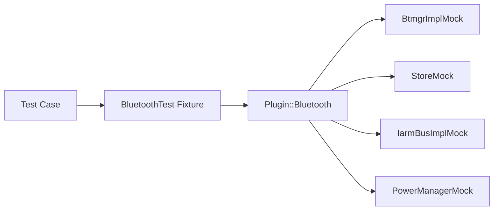
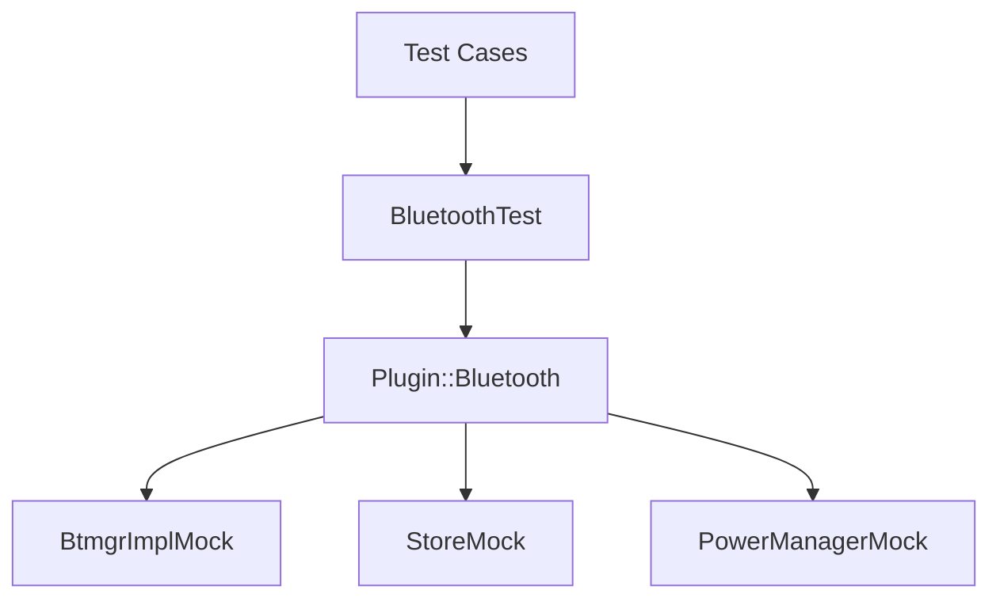
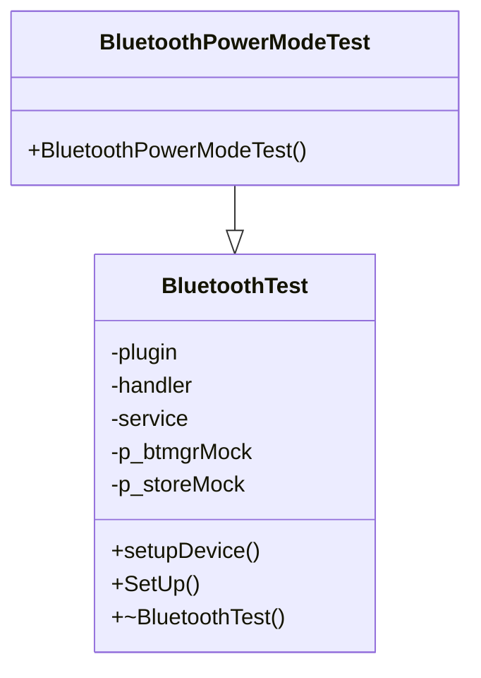
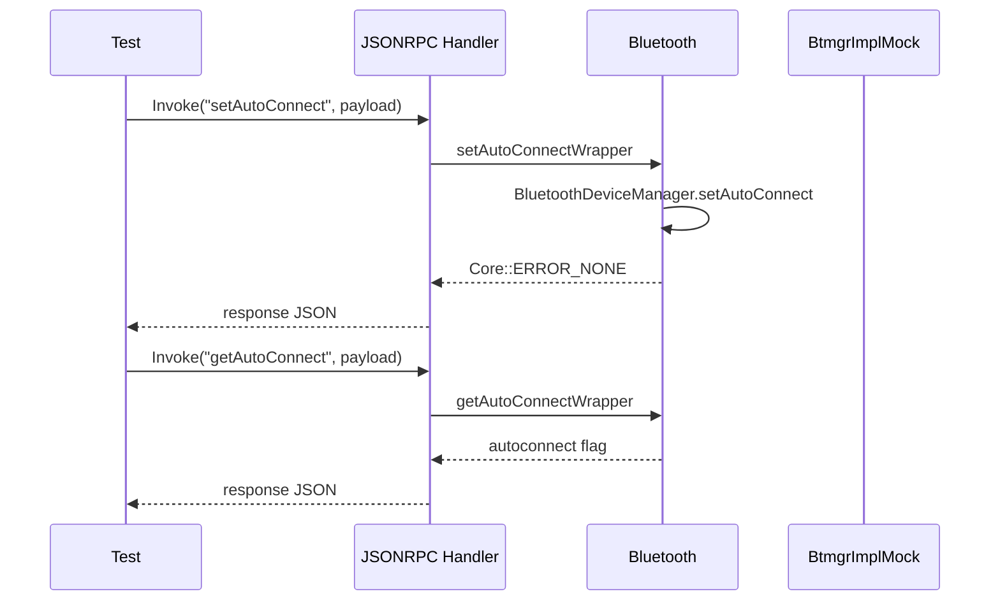
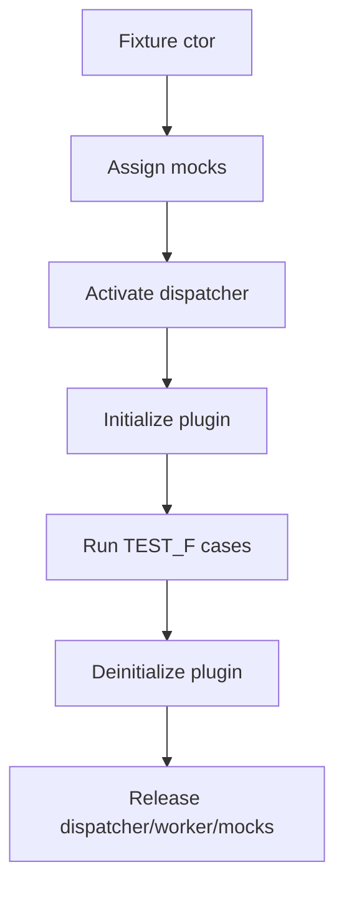

# Bluetooth L1 Testing Subsystem (`Tests/L1Tests/tests/test_Bluetooth.cpp`)

## 1. High-Level Purpose & Architecture

### Role in ENT / RDK infrastructure

This subsystem validates Bluetooth plugin JSON-RPC behavior and power-mode handling in L1 unit tests using GoogleTest/GoogleMock.

Primary file:
- [`Tests/L1Tests/tests/test_Bluetooth.cpp`](../Tests/L1Tests/tests/test_Bluetooth.cpp)

### Responsibilities

- Constructs plugin test fixture with mocks (`BtmgrImplMock`, `StoreMock`, `IarmBusImplMock`, PowerManager mock interactions).
- Validates wrapper API success/failure behavior.
- Validates device/cache interactions through `pair`, `setAutoConnect`, `getAutoConnect`.
- Validates `onPowerModeChanged` branches.

### Interacting subsystems and what it does not do

Interacts with mocked interfaces only; does not run against actual Bluetooth hardware stack in this file.

## 2. Architectural Overview

### Major components and interactions

- `BluetoothTest` fixture:
  - Creates plugin proxy and dispatcher.
  - Activates plugin in mocked service context.
  - Injects and resets mocks.
- `BluetoothPowerModeTest` fixture:
  - Preloads persistent-store JSON for HID behavior branch tests.

### High-level diagram



## 3. Code Organization (Folder & File-Level)

### Repository structure walkthrough

- `Tests/L1Tests/tests/test_Bluetooth.cpp`: test fixture + test cases.
- `Tests/L1Tests/tests/CMakeLists.txt`: present but empty.

### File-by-file breakdown

- **`test_Bluetooth.cpp`**:
  - fixture setup/teardown lifecycle
  - helper `setupDevice()` for paired-device preconditioning
  - test cases for wrappers and power transitions
- **`CMakeLists.txt` (empty)**:
  - no target declarations to document from this file.

## 4. Class & Interface Documentation

### `BluetoothTest` fixture

Responsibilities:
- Create plugin instance and JSONRPC handler.
- Initialize mocks and Thunder worker pool.
- Activate/deactivate dispatcher and plugin lifecycle.

Snippet:

```cpp
plugin(Core::ProxyType<Plugin::Bluetooth>::Create())
, handler(*(plugin))
...
dispatcher->Activate(&service);
EXPECT_EQ(string(""), plugin->Initialize(&service));
```

Source: [`test_Bluetooth.cpp`](../Tests/L1Tests/tests/test_Bluetooth.cpp)

### `BluetoothPowerModeTest` fixture

Responsibilities:
- Preload HID cache state via mocked persistent store.
- Preserve device through paired-device reconciliation.
- Exercise HID skip branch in power transitions.

## 5. Configuration & Build Integration

### Configuration files and parameters

L1 workflow file found:
- [`.github/workflows/L1-tests.yml`](../.github/workflows/L1-tests.yml)

Observed integration points:
- Workflow installs dependencies, builds Thunder/entservices-apis, and drives test setup.

### Build system info and flags

In `cov_build.sh`, L1/Coverity-related flags include:

```bash
-DRDK_SERVICES_L1_TEST=ON \
-DPLUGIN_BLUETOOTH=ON \
```

Source: [`cov_build.sh`](../cov_build.sh)

## 6. Internal Workflows & Execution Flow

### Initialization flow in tests

1. Construct mocks and assign implementation shims.
2. Setup `service.QueryInterfaceByCallsign` to return `StoreMock` for `org.rdk.PersistentStore`.
3. Activate plugin dispatcher.
4. Call `plugin->Initialize(&service)` unless fixture variant defers it.

### Request flow examples

- Wrapper invocation pattern:

```cpp
handler.Invoke(connection, _T("startScan"), _T("{\"timeout\":5}"), response)
```

- Assertions check `Core::ERROR_*` and response content fragments.

### Shutdown/error handling flow

- Teardown calls `plugin->Deinitialize`, dispatcher deactivation, worker pool cleanup, and mock unassignment.

## 7. Diagrams & Visual Aids

### Architecture



### Class diagram



### Sequence (read/write)



### Activity (lifecycle)



## 8. Testing & Quality Analysis

### Existing tests observed

The file includes broad wrapper coverage for:
- `getApiVersionNumber`, `startScan`, `stopScan`, `isDiscoverable`, `setDiscoverable`
- Device lists, connect/disconnect, pair/unpair
- Name getters/setters
- Audio playback command controls
- Event-response API
- Device info/media info
- Volume/mute API
- Auto-connect API
- Power mode transition branches

### Missing or unclear coverage

From available files only:
- No explicit tests found in this file for full `notifyEventWrapper` event emission matrix.
- No L2 Bluetooth tests were discovered.
- Build inclusion for this test file cannot be validated from `Tests/L1Tests/tests/CMakeLists.txt` because it is empty.

### Practical next test suggestions

- Add event-notification assertions for representative BTRMGR events.

## 10. CPESP-9452 Section-6 Regression Matrix

### AC1 migration scenarios

| Scenario | L1 coverage expectation |
| --- | --- |
| Existing PersistentStore data | Validate initialization uses stored metadata and does not require AS import overrides. |
| Missing PersistentStore + valid filesystem persistence file | Validate AS import path executes and normalized values are persisted. |
| Missing PersistentStore + missing filesystem persistence file | Validate non-fatal fallback and subsequent persistence update path remains functional. |
| Missing PersistentStore + malformed filesystem persistence file | Validate non-fatal fallback and plugin continues without crash. |

### AC2 rollback synchronization scenarios

| Scenario | L1 coverage expectation |
| --- | --- |
| Feature flag ON | Mutating persistence paths (for example setAutoConnect) mirror to filesystem persistence file output. |
| Feature flag OFF | Same mutating paths do not mirror to filesystem persistence file output. |

### AC3 compile-time isolation scenarios

| Scenario | L1 coverage expectation |
| --- | --- |
| Build with BLUETOOTH_ENABLE_PERSISTENCE_MIGRATION=OFF | Migration and rollback ticket-specific behavior is inactive and not required for baseline operation. |
| Baseline persistence under OFF build | Core Bluetooth persistence workflows remain functional. |

### ON/OFF execution guidance

- Flag ON run: execute L1 suite with migration-enabled build settings and verify AC1+AC2 paths.
- Flag OFF run: execute L1 suite with BLUETOOTH_ENABLE_PERSISTENCE_MIGRATION disabled and verify AC3 baseline behavior.
- Both runs are required for section-6 acceptance exit criteria.

### Upgrade and downgrade simulation expectations

- L1 scope expectation: simulate data-shape and feature-flag transition effects through controlled fixture payloads and ON/OFF builds.
- Limitation: full platform lifecycle transitions (package upgrade, persistent partition migration sequencing, and service orchestration) are outside pure L1 scope and require external validation environments.

### Validation evidence references

- Change artifacts: openspec/changes/tests-and-regression-coverage/
- Suggested evidence file: openspec/changes/tests-and-regression-coverage/regression-validation-evidence.md
- Capture raw ON/OFF command outputs and map each scenario to test names used in L1 runs.

## 9. Beginner-to-Expert Teaching Mode

### Must know first

1. Every wrapper test uses `handler.Invoke(...)` to simulate JSON-RPC calls.
2. `setupDevice()` prepares paired-device state needed for auto-connect and power tests.
3. Teardown hygiene is critical due to global mock implementation hooks.

### Advanced learning path

1. Follow one wrapper test from JSON payload to BTRMGR mock expectation.
2. Study power-mode fixtures to understand cache-dependent branch testing.
3. Expand into event-driven notification verification with emitted JSON payload checks.

## Ambiguities / Missing Inputs

- `Tests/L1Tests/tests/CMakeLists.txt` has no content; target wiring cannot be interpreted.
- No additional Bluetooth L1 test files were discovered in workspace file search results.
- L2 workflow files named `L2-tests.yml` and `L2-tests-oop.yml` were not found under `.github/workflows`, so cross-level CI validation cannot be documented from current files.