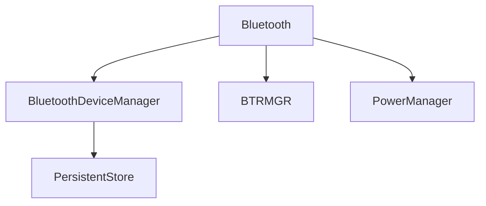
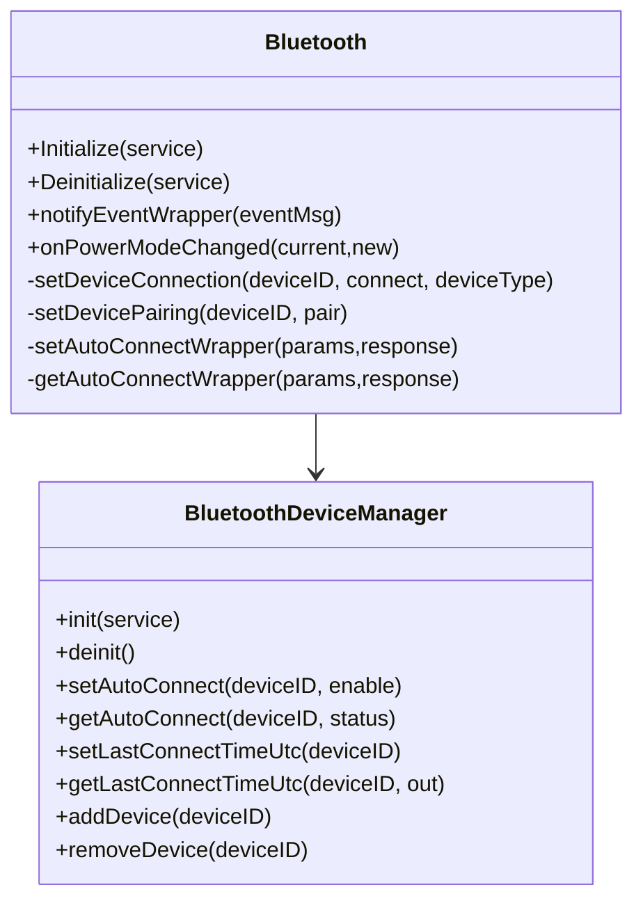
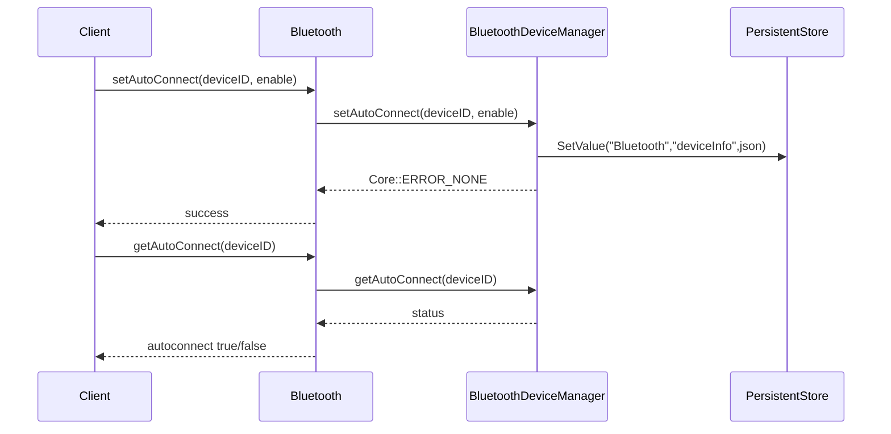
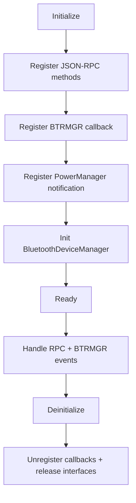

# Bluetooth Plugin Subsystem (`Bluetooth/`)

## 1. High-Level Purpose & Architecture

### Role in ENT / RDK infrastructure

The Bluetooth plugin is a Thunder/WPEFramework JSON-RPC plugin registered as `org.rdk.Bluetooth` with API version `1.1.0`.

Evidence:
- [`Bluetooth/Bluetooth.cpp`](../Bluetooth/Bluetooth.cpp)
- [`Bluetooth/Bluetooth.h`](../Bluetooth/Bluetooth.h)

### Responsibilities

- Exposes JSON-RPC methods for scanning, pairing, connecting, media control, and adapter properties.
- Converts JSON-RPC calls into BTRMGR API calls.
- Receives BTRMGR events and emits JSON-RPC notifications.
- Persists paired-device metadata (`deviceID`, `deviceType`, `autoconnect`, `lastConnectTimeUtc`, `lastVolumeSetting`) via `org.rdk.PersistentStore` through `BluetoothDeviceManager`. `deviceAddr` and `friendlyName` are not persisted; they are populated at runtime by backfilling from BTRMGR into the in-memory cache.
- Reacts to power mode transitions using `org.rdk.PowerManager`.

### Interacting subsystems and what it does not do

Interacts with:
- BTRMGR (`btmgr.h` APIs)
- Thunder plugin shell / JSONRPC (`PluginHost::IPlugin`, `PluginHost::JSONRPC`)
- PersistentStore (`Exchange::IStore`)
- PowerManager (`Exchange::IPowerManager`)

Does not do:
- Direct BLE stack management itself (delegates to BTRMGR).
- Multi-adapter policy (always uses adapter index `0` in observed calls).

## 2. Architectural Overview

### Major components and interactions

- `Bluetooth` class: RPC entrypoints + event bridge + power-policy transitions.
- `BluetoothDeviceManager` class: cache/storage sync for paired-device metadata.
- `DiscoveryTimer`: stops discovery when scan timeout expires.

### High-level diagram

```mermaid
flowchart LR
    Client[JSON-RPC Client] -->|org.rdk.Bluetooth.1.*| BT[Bluetooth Plugin]
    BT -->|BTRMGR_* calls| BTMGR[BTRMGR]
    BTMGR -->|event callback| BT
    BT -->|Notify(...)| Client
    BT -->|QueryInterfaceByCallsign| STORE[org.rdk.PersistentStore]
    BT -->|Power notifications| PM[org.rdk.PowerManager]
    BT --> BDM[BluetoothDeviceManager]
    BDM --> STORE
```

## 3. Code Organization (Folder & File-Level)

### Repository structure walkthrough (subsystem scope)

- `Bluetooth/CMakeLists.txt`: plugin target, dependencies, install, write_config.
- `Bluetooth/Module.h`, `Bluetooth/Module.cpp`: module declaration macros.
- `Bluetooth/Bluetooth.h`, `Bluetooth/Bluetooth.cpp`: plugin implementation.
- `Bluetooth/BluetoothDeviceManager.h`, `Bluetooth/BluetoothDeviceManager.cpp`: metadata persistence/cache manager.
- `Bluetooth/README.md`: API curl examples/events.

### File-by-file breakdown

- **`Bluetooth/Bluetooth.h`**: declares wrapper methods, internal helpers, event constants, lifecycle (`Initialize/Deinitialize`).
- **`Bluetooth/Bluetooth.cpp`**: registers methods, implements wrappers and internal BTRMGR operations, event translation, power mode behavior.
- **`Bluetooth/BluetoothDeviceManager.h/.cpp`**: defines `BluetoothDeviceInfo`, cache lock, PersistentStore synchronization, add/remove/set/get metadata.
- **`Bluetooth/CMakeLists.txt`**: builds `${NAMESPACE}Bluetooth`, links `${NAMESPACE}Plugins`, BTMGR, IARMBus.

## 4. Class & Interface Documentation

### `WPEFramework::Plugin::Bluetooth`

Responsibilities:
- Plugin lifecycle + RPC dispatcher.
- Request wrappers: `startScanWrapper`, `pairWrapper`, `setAutoConnectWrapper`, etc.
- Internal operations: `startDeviceDiscovery`, `setDeviceConnection`, `notifyEventWrapper`.

Lifecycle:
- `Initialize`: register JSON-RPC methods, init IARM, register BTRMGR callback, attach PowerManager notification, init `BluetoothDeviceManager`, disconnect selected externally connected devices.
- `Deinitialize`: deinit manager, unregister power callback and BTRMGR callbacks.

Snippet (method registration):

```cpp
Register(METHOD_START_SCAN, &Bluetooth::startScanWrapper, this);
Register(METHOD_SET_AUTO_CONNECT, &Bluetooth::setAutoConnectWrapper, this);
Register(METHOD_GET_AUTO_CONNECT_STATUS, &Bluetooth::getAutoConnectWrapper, this);
```

Source: [`Bluetooth/Bluetooth.cpp`](../Bluetooth/Bluetooth.cpp)

### `WPEFramework::Plugin::BluetoothDeviceManager`

Responsibilities:
- Cache paired device metadata in `_pairedDeviceCache`.
- Sync metadata with `Exchange::IStore` under:
  - namespace: `Bluetooth`
  - key: `deviceInfo`

On-disk PersistentStore JSON shape (per entry in the array stored at `deviceInfo`):

```json
{
  "deviceID": "<BTRMGR device handle as string>",
  "deviceType": "<string>",
  "autoconnect": "<integer: 0=disabled, 1=enabled, 2=unset>",
  "lastConnectTimeUtc": "<ISO-8601 string>",
  "lastVolumeSetting": "<integer>"
}
```

`deviceAddr` and `friendlyName` exist in the in-memory `BluetoothDeviceInfo` struct but are **not** written to PersistentStore. They are populated at runtime by `updateCacheFromDevice()`, which reads them from BTRMGR and backfills missing values into the cache.

Key methods:
- `init`, `deinit`
- `setAutoConnect`, `getAutoConnect`
- `setLastConnectTimeUtc`, `getLastConnectTimeUtc`
- `addDevice`, `removeDevice`, `getPairedDeviceInfos`

Snippet (storage key constants):

```cpp
#define PERSISTENT_STORE_CALLSIGN "org.rdk.PersistentStore"
#define PERSISTENT_STORE_NAMESPACE "Bluetooth"
#define PERSISTENT_STORE_KEY_DEVICE_INFO "deviceInfo"
```

Source: [`Bluetooth/BluetoothDeviceManager.h`](../Bluetooth/BluetoothDeviceManager.h)

## 5. Configuration & Build Integration

### Configuration files and parameters

- Plugin config artifacts:
  - `Bluetooth/Bluetooth.conf.in`
  - `Bluetooth/Bluetooth.config`
- Runtime API usage examples in `Bluetooth/README.md`.

### Build system info and flags

Root enable flag:

```cmake
if(PLUGIN_BLUETOOTH)
    add_subdirectory(Bluetooth)
endif()
```

Source: [`CMakeLists.txt`](../CMakeLists.txt)

Plugin build and linkage:

```cmake
set(PLUGIN_NAME Bluetooth)
set(MODULE_NAME ${NAMESPACE}${PLUGIN_NAME})
add_library(${MODULE_NAME} SHARED Bluetooth.cpp BluetoothDeviceManager.cpp Module.cpp)
target_link_libraries(${MODULE_NAME} PRIVATE ${NAMESPACE}Plugins::${NAMESPACE}Plugins ${IARMBUS_LIBRARIES})
```

Source: [`Bluetooth/CMakeLists.txt`](../Bluetooth/CMakeLists.txt)

Coverity script includes Bluetooth flag:

```bash
-DPLUGIN_BLUETOOTH=ON \
```

Source: [`cov_build.sh`](../cov_build.sh)

## 6. Internal Workflows & Execution Flow

### Initialization/startup

1. JSON-RPC methods registered.
2. BTRMGR callback registration.
3. PowerManager interface fetched and notification registered.
4. Device manager initialized from PersistentStore + paired-device reconciliation.
5. Externally connected non-HID devices with explicit `autoconnect=false` are disconnected.

### Request flow (read/write)

- **Read-like**: `getPairedDevices` -> BTRMGR list + enrich with cached metadata (`autoconnect`, `lastConnectTimeUtc`).
- **Write-like**: `setAutoConnect` -> update cache -> write PersistentStore -> emit status notification.

### Shutdown/error handling

- Deinitialize unregisters callbacks and releases interfaces.
- Wrappers return failure when required params are missing or internal operations fail.
- Some internal methods log failures but still return partial/default payloads (for example discovered/paired device list paths).

## 7. Diagrams & Visual Aids

### Architecture



### Class diagram



### Sequence (read/write)



### Activity (lifecycle)



## 8. Testing & Quality Analysis

Existing tests:
- [`Tests/L1Tests/tests/test_Bluetooth.cpp`](../Tests/L1Tests/tests/test_Bluetooth.cpp)

Observed coverage from this file includes:
- Method wrapper success/failure paths.
- Auto-connect set/get behavior.
- Power mode transition branches, including HID skip behavior.

Gaps observed from available files:
- No dedicated tests found for many `notifyEventWrapper` event variants.
- No L2 Bluetooth tests were found in workspace scan.
- `Tests/L1Tests/tests/CMakeLists.txt` contains no target declarations, for FLOW:IDE support.

## 9. Beginner-to-Expert Teaching Mode

### Must know first

1. `Bluetooth` wrappers are API boundary; internal methods execute BTRMGR operations.
2. `BluetoothDeviceManager` is the persistence authority for autoconnect and last-connect timestamp.
3. Power-state transitions modify connection behavior, especially HID exception handling.

### Advanced learning path

1. Trace one method end-to-end (`setAutoConnectWrapper` -> manager -> store -> event).
2. Map event translation logic in `notifyEventWrapper` from BTRMGR enums to JSON-RPC notifications.
3. Analyze power policy in `onPowerModeChanged` for ON/OFF/STANDBY/DEEP_SLEEP transitions.

## Ambiguities / Missing Inputs

- `Tests/L1Tests/tests/CMakeLists.txt` is empty in this workspace; exact CMake test registration is not derivable.
- CI files `L2-tests.yml` and `L2-tests-oop.yml` were not found under `.github/workflows`, so L2 integration status for Bluetooth cannot be confirmed from available files.